## Lab1 RDT实验报告

> 这次实验需要实现一个可靠的数据传输，来应对丢包、乱序的常见网络传输问题。实现的具体方法可以参考常见的滑动窗口协议，例如GBN、SR。根据给出的源代码，我们也只是在已有的代码框架上模拟实现一个传输，实际具体的传输的实现基于已给定的代码框架。

[TOC]

### 一、程序参数与结构

首先阅读`main`函数，程序输入需要指定7个参数

- `sim_time`：总共的模拟次数，按照second来计算（并不是实际的秒，后面的同理）
- `mean_msg_arrivalint`：从发送方上层传递的连续消息之间的平均间隔（以秒为单位）。实际值介于平均值的0和2倍之间。
- `mean_msg_size`：消息的平均大小（以字节为单位），实际上消息的大小在一倍到两倍之间变化
- `outoforder_rate`：乱序比例，正常的延迟是100毫秒，乱序就是说明延迟超过了100ms。如果乱序的比例式$0.1$，说明100个包里面有10个包没有按照正常的延迟发送到。当这个发生的时候，延迟在0~200ms之间变化。
- `loss_rate`：丢包的比例，$0.1$代表10个里面会出现1个丢失包的现象。
- `corrupt_rate`： 数据包损坏概率：值为0.1意味着平均每十个数据包中就有一个（不包括丢失的数据包）损坏。请注意，数据包的任何部分都可能损坏。
- `tracing_level`：日志的输出级别，1作为debug，0作为测试。

关于提交的代码：

- 我同时实现了SR和GBN协议，函数名字里面通过`_SR`、`_GBN`来标识。
-  需要测试不同的协议，只需要把对应的注释打开和关闭即可。

### 二、我的实现

#### 1）实现概述

- 关于接收端发送ACK包的数据格式，我定义为如下效果（参考我写的代码里面的注释）：

```
/*
* NOTE: My Own Realization of ACK Structure is:
*       First 4 Byte For Packet Sequence ID Number;
*       Then 4 Byte For hash(ID sequence + ifACK) avoid content being changed during transfer 
*       repeat possibility is 1/2^32
*       |<-  4 byte  ->|<-    4 byte  ->|
*       | ID sequence  | HashedCheckNum |
*/
```

- 关于发送端发送数据包的格式，我定义为如下效果（参考我写的代码里面的注释）：

```
/*
* NOTE: My Own Realization of Packet Structure is:
*       First 4 Byte For Packet Sequence ID Number;
*       Then  4 Byte For hash(ID sequence + payload size + payload) 
*          avoid content being changed during transfer 
*       repeat possibility is 1/2^32
*       Then  1 Byte For payload size, as original realization.
*       |<-  4 byte  ->|<-    4 byte  ->|<-  1 byte  ->|<-       the rest     ->|
*       | ID sequence  | HashedCheckNum | payload size |<-       payload      ->|
*
*/
```

- 首先我尝试了GBN这种回退N协议，实现的概述是：
  - 定一个大小为N的窗口，每次开始发送的时候，发起计时器，然后将这个窗口的数据包依次发送出去。
  - 因为GBN的ACK是累计确认，也就是说，假如接收端依次收到了1、2、6的包裹，在收到了6的时候，发送的ACK是2。
  - 然后，当收到ACK的时候，检查包是否被篡改，如果包数据正常，根据累计确认的ACK结果，移动窗口，然后继续发送窗口里面的所有数据
  - 如果发现超时，就把整个窗口里面的所有内容全部重发一遍。
- 然后，我决定尝试SR，选择回传，选择回传的效果明显要比GBN这种协议效率要高，因为发送的ACK是单独针对每个包裹的，接收端只需要重新发送没有收到ACK的包裹，即可。这样大大的节约了传输的包裹的数量，实验结果也证明，传输的包裹数量大约减少了2/3！。
  - 首先定一个大小为N的窗口，每次开始发送的时候，发起计时器，然后将这个窗口的数据包依次发送出去。
  - SR的ACK针对于每个包裹确认，所以发送端需要记录好那些已经被对方收到了
  - 然后，当收到ACK的时候，检查包是否被篡改，如果包数据正常，ACK确认的ID号码，编辑被对方收到的包裹的容器。之后再检查发送端的窗口里面，是否所有的包裹已经被对方**签收**，如果所有的都已经被签收，我们就滑动窗口到下一个为止，然后继续发。
  - 对于接收端，当收到包裹的时候，先看是顺序的还是乱序的。
    - 如果是顺序的，就可以给上层了。然后检查缓存里面的包裹是否是接着的，如果是，就继续递交缓存内容给上层
    - 如果是乱系的，就需要在放在Buffer缓存里面。
  - 如果超时，就根据发送端记录的结果，**只发送对方没有收到的包裹，已经被ACK的包裹不需要重发！**
- 动画演示参考（这两个网站提供了这两种协议详细的动画演示参考）：
  - [Go-Back Protocol (pearsoncmg.com)](https://media.pearsoncmg.com/aw/ecs_kurose_compnetwork_7/cw/content/interactiveanimations/go-back-n-protocol/index.html)
  - [Selective Repeat Protocol (pearsoncmg.com)](https://media.pearsoncmg.com/aw/ecs_kurose_compnetwork_7/cw/content/interactiveanimations/selective-repeat-protocol/index.html)

#### 2）代码解释

> 我按照整体消息发送处理的逻辑来解释一遍吧！这里的解释就按照SR选择回传来，如果都解释一遍可能太繁琐，而且两者很多有重复的地方

##### a）发送端发送

- 首先需要明白：这个函数会被上层反复调用，然后往里面塞msg，有时候塞的msg可能很小，有时候塞得可能非常大。塞得大就需要拆包发送，塞得小就可以直接发。
- 如果是第一次调用的话，会发送整个发送缓冲区里面的前N个包裹（N是窗口大小）
- 发送前，我们需要组装pkg，只需要进行一下常规的内存拷贝和哈希处理即可。
- 完成之后放入缓冲区，然后等待发送。
- **值得注意的时候，标ID-Seq的号的时候，需要根据缓冲区里面已经有的包裹数量来标记，原因还是因为这个函数会被调用很多次。比如第一次发的msq要拆两个包裹，第二次发的msg要拆一个包裹发，那第二次的时候标号就是3，而不是1。**

```c++
void Sender_FromUpperLayer_SR(struct message *msg){
    rdt_sender_mutex.lock();
    
    packet pkt;
    for(int cursor = 0; cursor < msg ->size; cursor += Packet_Payload_Length){
        /* take msg into many Parts */
        /* Calculate currently Packet Seq ID and this Part Payload Length */
        /* Start from 1, to ++.. */
        
        unsigned int Part_SeqID = rdt_sender_buffer.size() + 1;

        unsigned char Part_PayloadLength = std::min(msg -> size - cursor, Packet_Payload_Length);
        /* convert data to string in order to joint */
        std::string dataStr(msg -> data + cursor, msg -> data + cursor +  Part_PayloadLength);
        /* get hashed val */
        unsigned int Part_Hashed = hash_str_sender(std::to_string(Part_SeqID) + std::to_string(Part_PayloadLength) + dataStr);
        
        /* fill in the packet */
        // 把SeqID拷贝过去
        memcpy(pkt.data + Packet_ID_Sequence_Offset , &Part_SeqID, Packet_ID_Sequence_Length);
        // 把Hash Value拷贝过去
        memcpy(pkt.data + Packet_HashedCheckNum_Offset, &Part_Hashed, Packet_HashedCheckNum_Length);
        // 把payload size 拷贝过去
        memcpy(pkt.data + Packet_PayloadSize_Offset, &Part_PayloadLength, Packet_PayloadSize_Length);
        // 把payload 拷贝过去
        memcpy(pkt.data + Packet_Payload_Offset, msg -> data + cursor, Part_PayloadLength);
        
        
        rdt_sender_buffer.push_back(pkt);
    }
    
    if(!send_start){
        // SR 发前面的N个
        for(unsigned int i = Moving_Window_Left_Index; i <= Moving_Window_Right_Index && i <rdt_sender_buffer.size(); i++){
            Sender_ToLowerLayer(&rdt_sender_buffer[i]);
            // buffer 里面的 buffer[i] 对应seqID i+1
            //printf("[init] 发送！%u \n", i + 1);
            Already_Send_Max_ID_Sequence = std::max(Already_Send_Max_ID_Sequence, i + 1);
        }
        send_start = true;
        Sender_StartTimer(TimeOutValue);
    }
    rdt_sender_mutex.unlock();
}
```

##### b）收包裹处理函数

- 处理逻辑先解包，然后校验Hash是否正确，防篡改
- 需要一个变量`X`来记录当前已经处理好的包裹序列的最大值，然后传给上层，这个变量的意义是：
  - 如果发现新来的数据包的序列号是`X+1`，那就是顺序接着的，直接把组装好的信息交给上层。
  - 如果发现不是，说明出现了乱序的问题。这时候先缓存，然后再等到后面处理。

- 当然，处理了新的数据包之后，需要根据情况处理`X`值

```c++

// 接受者处理SR的逻辑
void Receiver_FromLowerLayer_SR(struct packet *pkt){
    ASSERT(pkt != NULL)
    rdt_receiver_mutex.lock();

    // 获取包里面的相关值
    unsigned int Part_SeqID = 0;
    memcpy(&Part_SeqID, pkt -> data + Packet_ID_Sequence_Offset, Packet_ID_Sequence_Length);
    
    // 把Hash Value拷贝过去
    unsigned int Part_Hashed = 0;
    memcpy(&Part_Hashed, pkt -> data + Packet_HashedCheckNum_Offset, Packet_HashedCheckNum_Length);
    
    // 把Payload Length拷贝过去
    unsigned char Part_PayloadLength = 0;
    memcpy(&Part_PayloadLength, pkt -> data + Packet_PayloadSize_Offset, Packet_PayloadSize_Length);

    
    if((unsigned int)Part_PayloadLength <= Packet_Payload_Length){
        std::string dataStr(pkt -> data + Packet_Payload_Offset, pkt -> data + Packet_Payload_Offset + Part_PayloadLength);
        //printf("%u !\n", Part_PayloadLength);
        // 开始校验是否信息被篡改过！
        unsigned int hash_cal = hash_str_receiver(std::to_string(Part_SeqID) + std::to_string(Part_PayloadLength) + dataStr);
        // printf("[Receiver_FromLowerLayer_GBN] point1 \n");
        // 消息没有被篡改 
        // 
        if(hash_cal == Part_Hashed){
            // if(Part_SeqID <= Already_Received_Max_ID_Sequence){
            //     SR_Ack(Part_SeqID);
            // }
            // 乱序了！这时候处理方法，SR会先缓存所有数据，发送对应的ACK
            // 举例：依次收到1、2、3、6，处理6的收到的时候，发ack6，然后等待4、5的发来或者超时重新传输
            if(Part_SeqID != Already_Received_Max_ID_Sequence + 1){
                // 定义一个rest msg
                struct message *rest_msg = (struct message*) malloc(sizeof(struct message));
                ASSERT(rest_msg != NULL)
                // 把payload 拷贝过去
                rest_msg -> size = (int)Part_PayloadLength;
                rest_msg -> data = (char*)malloc(rest_msg ->size);
                ASSERT(rest_msg -> data != NULL);
                memcpy(rest_msg -> data, pkt -> data + Packet_Payload_Offset,  Part_PayloadLength);

                rdt_receiver_buffer[Part_SeqID] = rest_msg;
                SR_Ack(Part_SeqID);
                //printf("收到！ expect: %u [乱序]%u \n", Already_Received_Max_ID_Sequence + 1 , Part_SeqID);
            }
            // 是下一个要接受的包，没有乱序
            else{

                Already_Received_Max_ID_Sequence = Part_SeqID;
                // 定义一个rest msg
                struct message *rest_msg = (struct message*) malloc(sizeof(struct message));
                ASSERT(rest_msg != NULL)
                
                // 把payload 拷贝过去
                
                rest_msg -> size = (int)Part_PayloadLength;
                rest_msg -> data = (char*)malloc(rest_msg ->size);

                ASSERT(rest_msg -> data != NULL);
                memcpy(rest_msg -> data, pkt -> data + Packet_Payload_Offset,  Part_PayloadLength);

                Receiver_ToUpperLayer(rest_msg);
                //printf("收到！[顺序]%u \n", Part_SeqID);
                SR_Ack(Part_SeqID);
 
                if(rest_msg ->data != NULL) free(rest_msg ->data);
                if(rest_msg != NULL) free(rest_msg);

                //此外还要加一个步骤，检查buffer里面，如果buffer不是空，且正好是刚接手的下一个，那我就要处理buffer里面的数据
                //printf("size %u \n" , rdt_receiver_buffer.size());

                while(!rdt_receiver_buffer.empty() && rdt_receiver_buffer.begin()->first <= Already_Received_Max_ID_Sequence){
                    rdt_receiver_buffer.erase(rdt_receiver_buffer.begin());
                }
                
                while(!rdt_receiver_buffer.empty() && rdt_receiver_buffer.begin()->first == Already_Received_Max_ID_Sequence + 1){
                    //printf("收到！[while]%u \n", rdt_receiver_buffer.begin()->first);
                    struct message *rest_msg = rdt_receiver_buffer.begin()->second;
                    Receiver_ToUpperLayer(rdt_receiver_buffer.begin()->second);
                    rdt_receiver_buffer.erase(rdt_receiver_buffer.begin());
                    Already_Received_Max_ID_Sequence += 1;

                    // 回收内存！
                    if(rest_msg ->data != NULL) free(rest_msg ->data);
                    if(rest_msg != NULL) free(rest_msg);
                }
            }
        }
    }

    // memcpy(pkt -> data + Packet_Payload_Offset, msg -> data + cursor, Part_PayloadLength);
    // printf("[Receiver_FromLowerLayer_GBN] end \n");
    rdt_receiver_mutex.unlock();
}
```

##### c）超时

- 超时的话：如果是GBN的话，那就需要全部重新发，
- 如果是SR的话，根据查询`rdt_sender_ackRecord`的情况，然后来判断是否需要重新传输
- 特别提示：发起计时器的时候需要谨慎，否则一不小心可能会让计时器死循环

```c++
void Sender_Timeout_GBN()
{
    rdt_sender_mutex.lock();
    
    // 根据GBN规则，只要超时，全部重新发！
    for(unsigned int i = Moving_Window_Left_Index; i <= Moving_Window_Right_Index; i++){
        // 变量 i 非法，不访问直接终止循环
        if(i >= rdt_sender_buffer.size())
            break;
        // 特别注意：发起计时器的时候要谨慎！不然会死循环。
        if(i == Moving_Window_Left_Index)
            Sender_StartTimer(TimeOutValue);
        Sender_ToLowerLayer(&rdt_sender_buffer[i]);
        
        Already_Send_Max_ID_Sequence = std::max(Already_Send_Max_ID_Sequence, (i + 1));
    }

    rdt_sender_mutex.unlock();
}

void Sender_Timeout_SR(){
    rdt_sender_mutex.lock();
    bool ifLaunched = false;
    // 根据SR规则，遇到超时的时候选择性传没有收到的
    for(unsigned int i = Moving_Window_Left_Index; i <= Moving_Window_Right_Index; i++){
        // 变量 i 非法，不访问直接终止循环
        if(i >= rdt_sender_buffer.size())
            break;
        // 特别注意：发起计时器的时候要谨慎！不然会死循环。        
        if(rdt_sender_ackRecord.count(i + 1))
            continue;
        else{
            //printf("超时发送！%u \n", i + 1);
            Sender_ToLowerLayer(&rdt_sender_buffer[i]);
            if(!ifLaunched){
                Sender_StartTimer(TimeOutValue);
                ifLaunched = true;
            }
                
        }
        Already_Send_Max_ID_Sequence = std::max(Already_Send_Max_ID_Sequence, (i + 1));
    }

    rdt_sender_mutex.unlock();

}
```

##### d）ACK确认的发送

- 这个比较简单，基本上包消息对应的内容拷贝过去即可。

```c++
void SR_Ack(unsigned int seqID){
    // 提示：综合考虑，SR的ACK发送和基本没有什么特别大的差异，直接复用
    
    struct packet* ack_resp = (struct packet*) malloc(sizeof(struct packet));
    if(ack_resp != NULL){
        unsigned int HashedStr = hash_str_receiver(std::to_string(seqID));
        memcpy(ack_resp->data + ACK_ID_Sequence_Offset,&seqID, ACK_ID_Sequence_Length);
        memcpy(ack_resp->data + ACK_HashedCheckNum_Offset, &HashedStr, ACK_HashedCheckNum_Lenght);
        Receiver_ToLowerLayer(ack_resp);
        
        free(ack_resp);
    }
}

```

### 三、效果测试与解释

#### 1）GBN

```
./rdt_sim 1000 0.1 100 0 0 0 0
./rdt_sim 1000 0.1 100 0.02 0 0 0
./rdt_sim 1000 0.1 100 0 0.02 0 0
./rdt_sim 1000 0.1 100 0 0 0.02 0
./rdt_sim 1000 0.1 100 0.02 0.02 0.02 0
./rdt_sim 1000 0.1 100 0.15 0.15 0.15 0
./rdt_sim 1000 0.1 100 0.3 0.3 0.3 0
```

```
./rdt_sim 1000 0.1 100 0 0 0 0
```

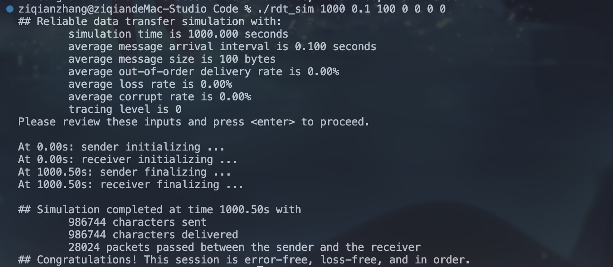

```
./rdt_sim 1000 0.1 100 0.02 0 0 0
```

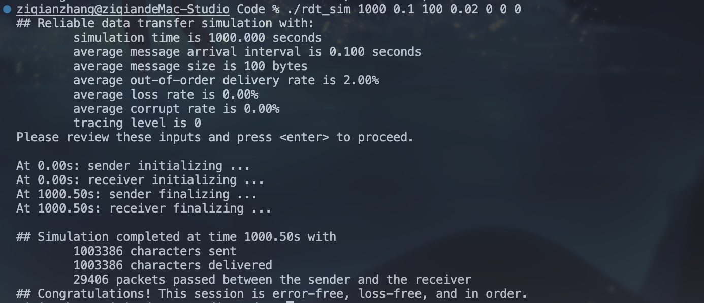

```
./rdt_sim 1000 0.1 100 0 0.02 0 0
```

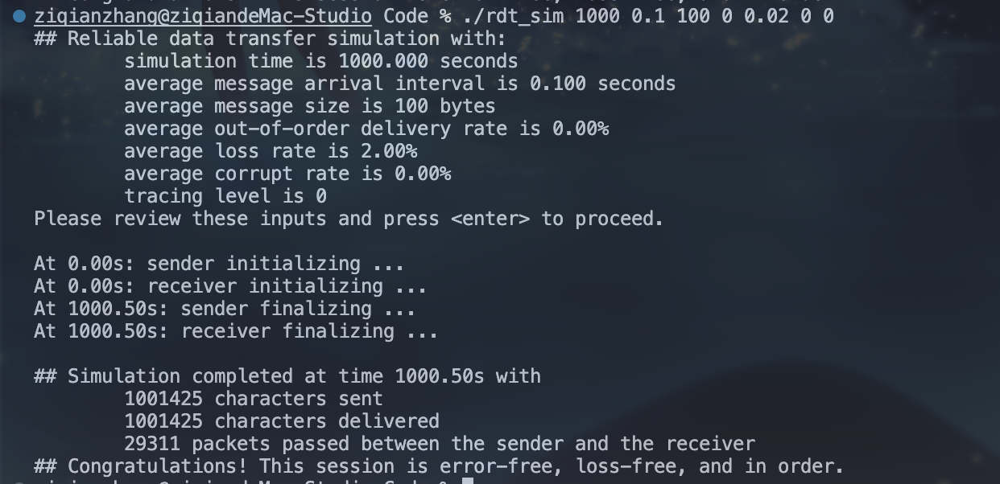

```
./rdt_sim 1000 0.1 100 0.02 0.02 0.02 0
```

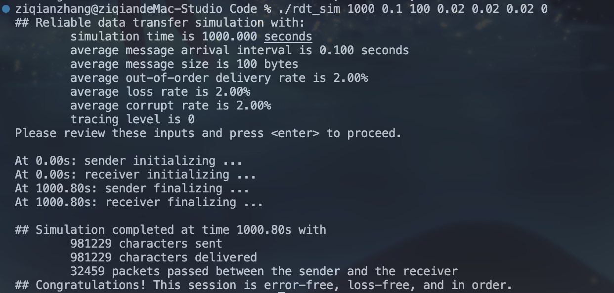

```
./rdt_sim 1000 0.1 100 0.15 0.15 0.15 0
```

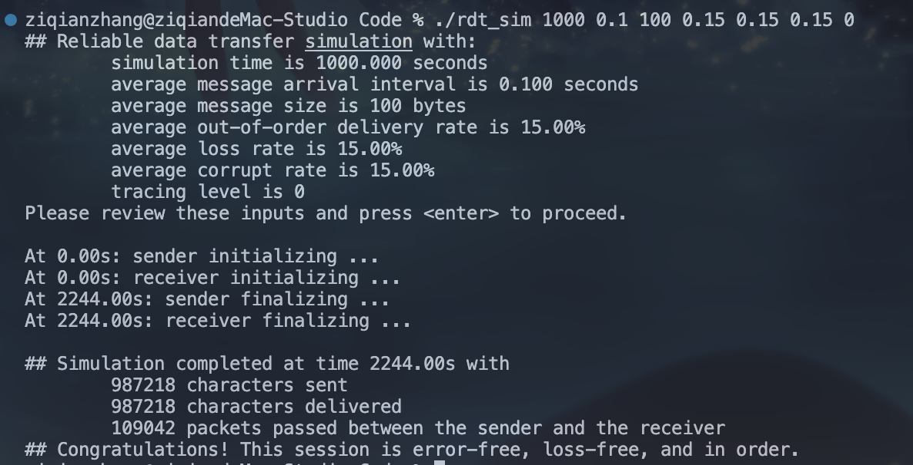

```
./rdt_sim 1000 0.1 100 0.3 0.3 0.3 0
```

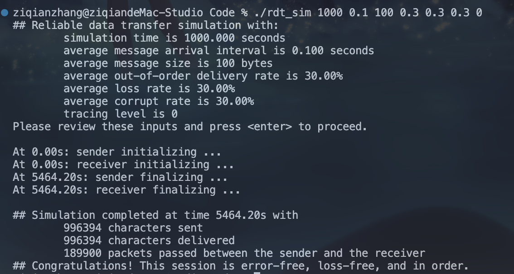

#### 2）SR

测试效果如下：全部都是通过测试的，效率相比GBN也有提升。（全部测似乎没太大必要，直接测最后三组，综合效果一样的，也能说明程序的正确性）

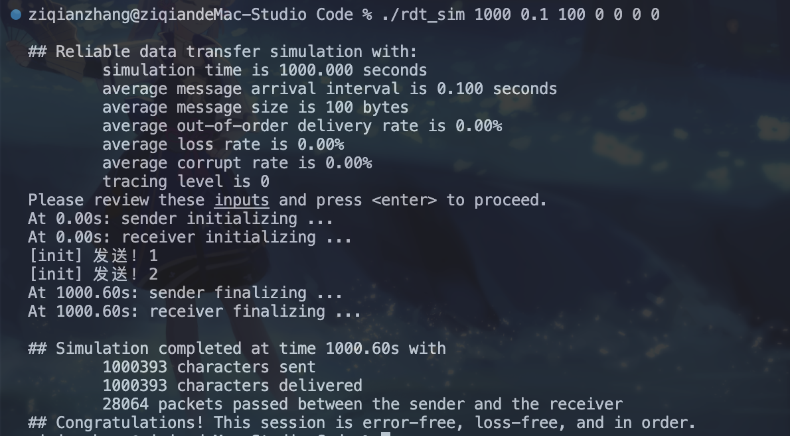

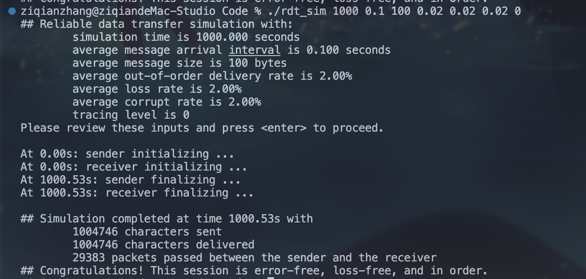

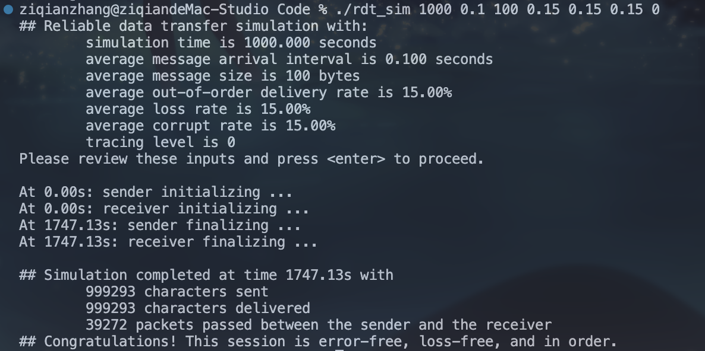

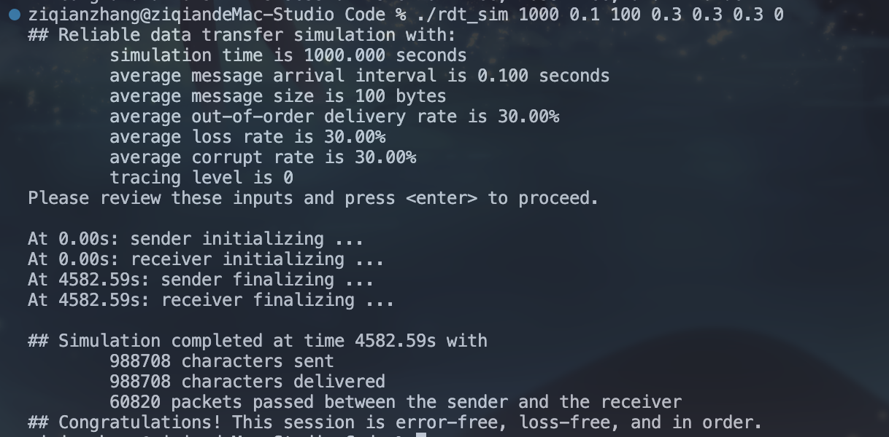

当然我也对他进行了一些压力测试，对于超高的丢包率、损坏率、乱序的情况，也确保可以正常运行！截图如下：

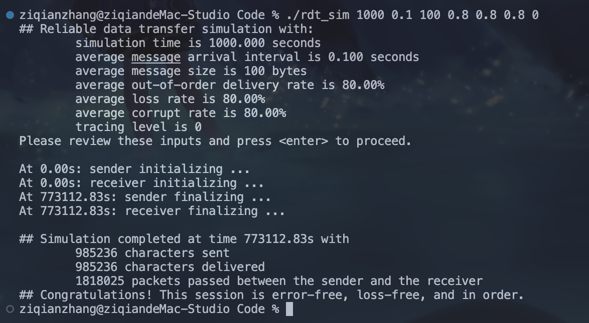


#### 3）对比和分析

- 首先对比实验要求里面给出的数据
  - 我实现的GBN要比给出的参考数据偏高一些，推测原因是我实现的GBN的接收窗口长度相当于1，没有设置缓冲区，也就是说当有包裹提前到达的时候，是会被直接丢弃的，这也造成了一些传输的浪费。
  - 我实现的SR和给出的参考数据基本一致（0.15组我的包裹数39000，给出参考数据是38066，基本一致）（0.3组：我传输用的包裹数60820，参考值59417，基本可以忽略误差）
  - 总体来说，和实验要求给定的数据大差不差，基本属于一致。
- 然后横向对比GBN和SR，显然SR传递的消耗的包裹数量要更少一些。分析原因，选择重传的里面，传输只需要传输没有被ACK的包裹，但是GBN里面，一旦超时或者没收到，整个窗口里面的东西都需要全部传输一遍，所以SR对于资源的利用要更好一些。

### 四、我遇到的问题

#### a）SR的包裹数传输异常

我遇到的最大的问题就是：刚刚实现完成SR协议之后，我发现发送的数据包的数量是正常值的三倍！也就是说参考值大约为5万个数据包的情况下，我最初实现的SR协议传输花费了15万个数据包，这显然不合理。于是乎我打印了日志。

从日志里面我发现，初始化发送的前N个包裹，居然被反复的发送了非常多次！究其根本，就是`Sender_FromUpperLayer`这个函数，被上层反复调用，而我在里面处理数据的时候，每次都做了一次初始化发送，这才导致多出来两倍的数据包，修复之后，问题马上得以解决了。

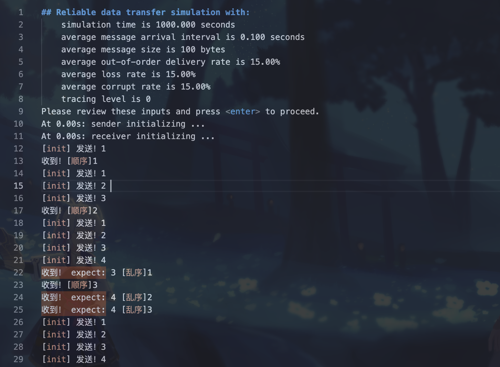

#### b）回收内存

这个实验里面很多地方会涉及到内存分配，分配了内存就要及时回收，否则导致内容泄露，最终甚至因为内存不足，导致程序直接崩溃的情况。

当然内存回收也不是一味的回收，需要考虑好回收内存的位置。有些地方，已经有上层的函数帮助回收了，这时候再回收就会出错。

下面是一个需要自己回收的例子，就是发送ACK的时候，这里回收只需要在发送端回收内存即可！

```c++
void GBN_Ack(unsigned int seqID){
    // 提示：记得回收内存！
    // 超级大坑！在哪回收内存！不是在接收ack的sender的函数回收内存，是在这里直接回收！
    // 因为Receiver_ToLowerLayer函数会做一个深度拷贝！
  
    struct packet* ack_resp = (struct packet*) malloc(sizeof(struct packet));
    if(ack_resp != NULL){
        unsigned int HashedStr = hash_str_receiver(std::to_string(seqID));
        memcpy(ack_resp->data + ACK_ID_Sequence_Offset,&seqID, ACK_ID_Sequence_Length);
        memcpy(ack_resp->data + ACK_HashedCheckNum_Offset, &HashedStr, ACK_HashedCheckNum_Lenght);
        Receiver_ToLowerLayer(ack_resp);
        // 回收内存！
        free(ack_resp);
    }
}
```

#### c）微小的Bug

- 其他的bug例如加锁之后，注意不要在程序里面写return，哪怕写了return的时候，要在前面释放锁。否则程序死循环。
- 还有一个问题就是，我传递的包裹的序列号是1-base的，但是在滑动窗口的时候，数组是0-base的，所以这也造成了我在后续编码过程中需要经过一些转换过程，当然如果还有时间能够修改的话可能我最终会选择所有的ID序列号都是0-base，这样避免了一些不必要的麻烦。
- 剩下的问题基本上靠日志输出即可解决。


