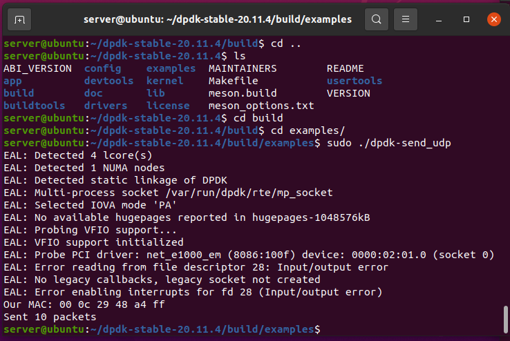
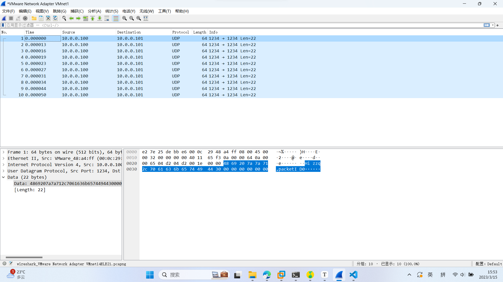
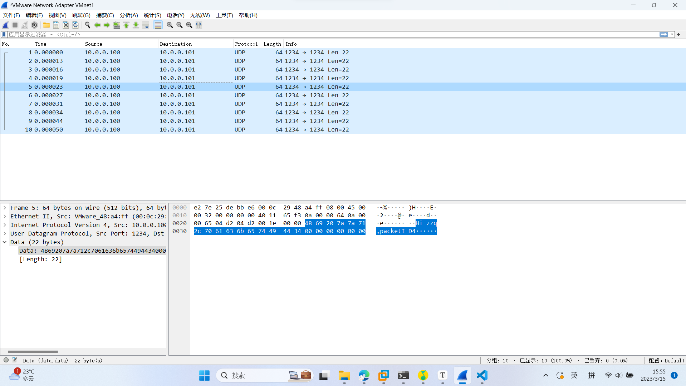
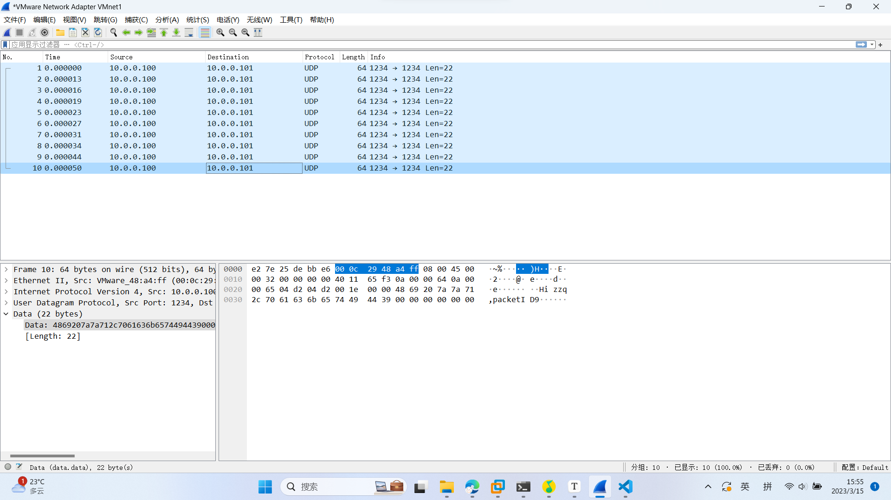

## Lab2 Dpdk

张子谦 520111910121


> What's the purpose of using hugepage?

用于数据包缓冲区的大内存池分配需要Hugepage支持（必须在运行的内核中启用HUGETLBFS选项）通过使用hugepage分配，性能得到了提高，因为需要的页面更少，因此:Translation Lookaside Buffer（TLB）也更少，从而减少了将虚拟页面地址转换为物理页面地址所需的时间。如果没有巨大的页面，标准4k页面大小会导致TLB丢失率高，从而降低性能。

> Take examples/helloworld as an example, describe the execution flow of DPDK programs?

参考深入浅出DPDK的内容，DPDK里的HelloWorld它建立了一个多核（线程）运行的基础环境，每个线程会打 印“hello from core#”，core#是由操作系统管理的。

```c++
int main(int argc, char **argv)
{
	int ret;
	unsigned lcore_id;
	ret = rte_eal_init(argc, argv);
	if (ret < 0)
		rte_panic(“Cannot init EAL\n”);
	/* call lcore_hello() on every slave lcore */
		RTE_LCORE_FOREACH_SLAVE(lcore_id) {
		rte_eal_remote_launch(lcore_hello, NULL, lcore_id);
	}
	/* call it on master lcore too */
	lcore_hello(NULL);
	rte_eal_mp_wait_lcore();
	return 0;
}
```

主线程运行入口是main函数，调用了`rte_eal_init`入口函数，启动基础运行环境。入口参数是启动DPDK的命令行，可以是长长的一串很复杂的设置，具体内容可以参考源代码 `\lib\librte_eal\common\eal_common_options.c`。对于HelloWorld这个实 例，最需要的参数是“-c”，线程掩码（core mask）指定了需 要参与运行的线程（核）集合。rte_eal_init本身所完成的工作很复杂， 它读取入口参数，解析并保存作为DPDK运行的系统信息，依赖这些信息，构建一个针对包处理设计的运行环境。

主要动作分解如下：1、配置初始化；2、内存初始化；3、队列初始化、告警初始化、终端初始化、PCI初始化、定时器初始化、检测内存本地化、主线程初始化、轮训设备初始化、建立主从线程通道等.

> Read the codes of examples/skeleton, describe DPDK APIs related to sending and receiving packets.

```cpp
/* SPDX-License-Identifier: BSD-3-Clause
 * Copyright(c) 2010-2015 Intel Corporation
 */

#include <stdint.h>
#include <inttypes.h>
#include <rte_eal.h>
#include <rte_ethdev.h>
#include <rte_cycles.h>
#include <rte_lcore.h>
#include <rte_mbuf.h>

#define RX_RING_SIZE 1024
#define TX_RING_SIZE 1024

#define NUM_MBUFS 8191
#define MBUF_CACHE_SIZE 250
#define BURST_SIZE 32

static const struct rte_eth_conf port_conf_default = {
	.rxmode = {
		.max_rx_pkt_len = RTE_ETHER_MAX_LEN,
	},
};

/* basicfwd.c: Basic DPDK skeleton forwarding example. */

/*
 * Initializes a given port using global settings and with the RX buffers
 * coming from the mbuf_pool passed as a parameter.
 */
static inline int
port_init(uint16_t port, struct rte_mempool *mbuf_pool)
{
	struct rte_eth_conf port_conf = port_conf_default;
	const uint16_t rx_rings = 1, tx_rings = 1;
	uint16_t nb_rxd = RX_RING_SIZE;
	uint16_t nb_txd = TX_RING_SIZE;
	int retval;
	uint16_t q;
	struct rte_eth_dev_info dev_info;
	struct rte_eth_txconf txconf;

	if (!rte_eth_dev_is_valid_port(port))
		return -1;

	retval = rte_eth_dev_info_get(port, &dev_info);
	if (retval != 0) {
		printf("Error during getting device (port %u) info: %s\n",
				port, strerror(-retval));
		return retval;
	}

	if (dev_info.tx_offload_capa & DEV_TX_OFFLOAD_MBUF_FAST_FREE)
		port_conf.txmode.offloads |=
			DEV_TX_OFFLOAD_MBUF_FAST_FREE;

	/* Configure the Ethernet device. */
	retval = rte_eth_dev_configure(port, rx_rings, tx_rings, &port_conf);
	if (retval != 0)
		return retval;

	retval = rte_eth_dev_adjust_nb_rx_tx_desc(port, &nb_rxd, &nb_txd);
	if (retval != 0)
		return retval;

	/* Allocate and set up 1 RX queue per Ethernet port. */
	for (q = 0; q < rx_rings; q++) {
		retval = rte_eth_rx_queue_setup(port, q, nb_rxd,
				rte_eth_dev_socket_id(port), NULL, mbuf_pool);
		if (retval < 0)
			return retval;
	}

	txconf = dev_info.default_txconf;
	txconf.offloads = port_conf.txmode.offloads;
	/* Allocate and set up 1 TX queue per Ethernet port. */
	for (q = 0; q < tx_rings; q++) {
		retval = rte_eth_tx_queue_setup(port, q, nb_txd,
				rte_eth_dev_socket_id(port), &txconf);
		if (retval < 0)
			return retval;
	}

	/* Start the Ethernet port. */
	retval = rte_eth_dev_start(port);
	if (retval < 0)
		return retval;

	/* Display the port MAC address. */
	struct rte_ether_addr addr;
	retval = rte_eth_macaddr_get(port, &addr);
	if (retval != 0)
		return retval;

	printf("Port %u MAC: %02" PRIx8 " %02" PRIx8 " %02" PRIx8
			   " %02" PRIx8 " %02" PRIx8 " %02" PRIx8 "\n",
			port,
			addr.addr_bytes[0], addr.addr_bytes[1],
			addr.addr_bytes[2], addr.addr_bytes[3],
			addr.addr_bytes[4], addr.addr_bytes[5]);

	/* Enable RX in promiscuous mode for the Ethernet device. */
	retval = rte_eth_promiscuous_enable(port);
	if (retval != 0)
		return retval;

	return 0;
}

/*
 * The lcore main. This is the main thread that does the work, reading from
 * an input port and writing to an output port.
 */
static __rte_noreturn void
lcore_main(void)
{
	uint16_t port;

	/*
	 * Check that the port is on the same NUMA node as the polling thread
	 * for best performance.
	 */
	RTE_ETH_FOREACH_DEV(port)
		if (rte_eth_dev_socket_id(port) >= 0 &&
				rte_eth_dev_socket_id(port) !=
						(int)rte_socket_id())
			printf("WARNING, port %u is on remote NUMA node to "
					"polling thread.\n\tPerformance will "
					"not be optimal.\n", port);

	printf("\nCore %u forwarding packets. [Ctrl+C to quit]\n",
			rte_lcore_id());

	/* Run until the application is quit or killed. */
	for (;;) {
		/*
		 * Receive packets on a port and forward them on the paired
		 * port. The mapping is 0 -> 1, 1 -> 0, 2 -> 3, 3 -> 2, etc.
		 */
		RTE_ETH_FOREACH_DEV(port) {

			/* Get burst of RX packets, from first port of pair. */
			struct rte_mbuf *bufs[BURST_SIZE];
			const uint16_t nb_rx = rte_eth_rx_burst(port, 0,
					bufs, BURST_SIZE);

			if (unlikely(nb_rx == 0))
				continue;

			/* Send burst of TX packets, to second port of pair. */
			const uint16_t nb_tx = rte_eth_tx_burst(port ^ 1, 0,
					bufs, nb_rx);

			/* Free any unsent packets. */
			if (unlikely(nb_tx < nb_rx)) {
				uint16_t buf;
				for (buf = nb_tx; buf < nb_rx; buf++)
					rte_pktmbuf_free(bufs[buf]);
			}
		}
	}
}

/*
 * The main function, which does initialization and calls the per-lcore
 * functions.
 */
int
main(int argc, char *argv[])
{
	struct rte_mempool *mbuf_pool;
	unsigned nb_ports;
	uint16_t portid;

	/* Initialize the Environment Abstraction Layer (EAL). */
	int ret = rte_eal_init(argc, argv);
	if (ret < 0)
		rte_exit(EXIT_FAILURE, "Error with EAL initialization\n");

	argc -= ret;
	argv += ret;

	/* Check that there is an even number of ports to send/receive on. */
	nb_ports = rte_eth_dev_count_avail();
	if (nb_ports < 2 || (nb_ports & 1))
		rte_exit(EXIT_FAILURE, "Error: number of ports must be even\n");

	/* Creates a new mempool in memory to hold the mbufs. */
	mbuf_pool = rte_pktmbuf_pool_create("MBUF_POOL", NUM_MBUFS * nb_ports,
		MBUF_CACHE_SIZE, 0, RTE_MBUF_DEFAULT_BUF_SIZE, rte_socket_id());

	if (mbuf_pool == NULL)
		rte_exit(EXIT_FAILURE, "Cannot create mbuf pool\n");

	/* Initialize all ports. */
	RTE_ETH_FOREACH_DEV(portid)
		if (port_init(portid, mbuf_pool) != 0)
			rte_exit(EXIT_FAILURE, "Cannot init port %"PRIu16 "\n",
					portid);

	if (rte_lcore_count() > 1)
		printf("\nWARNING: Too many lcores enabled. Only 1 used.\n");

	/* Call lcore_main on the main core only. */
	lcore_main();

	/* clean up the EAL */
	rte_eal_cleanup();

	return 0;
}
```

主要有下面三个函数：

`rte_pktmbuf_pool_create`函数的功能是创建数据包的内存缓冲池。

```c++
struct rte_mempool* rte_pktmbuf_pool_create	(
	const char* name, 
	unsigned n, 
	unsigned cache_size, 
	uint16_t priv_size, 
	uint16_t data_room_size, 
	int socket_id
	)
```

- 参数名称的说明：name是创建的名字，然后cache_size代表的是缓存区的大小、参数n是mbuf池中的元素数。socket_id指示应该分配内存的套接字标识符。 priv_size表示rte_mbuf结构和数据缓冲区之间的应用程序专用大小，他会与rte_mbuf_priv_ALIGN对齐。
- 返回值的说明：成功时返回指向新分配的内存池的指针，错误时返回NULL，

`rte_eth_rx_burst` 函数接口：`static uint16_t rte_eth_rx_burst (uint16_t port_id, uint16_t queue_id, struct rte_mbuf** rx_pkts, const uint16_t nb_pkts)	`，会从从接收队列中检索输入分组的突发。检索到的数据包存储在rte_mbuf结构中，其指针在rx_pkts数组中提供。

- 参数port_id是以太网设备的端口标识符。
- 参数queue_id表示的是从中检索输入数据包的接收队列的索引。
- 参数rx_pkts表示指向rte_mbuf结构的指针数组的地址，该数组必须足够大，以便在其中存储nb_pkts指针。
- 参数nb_pkt是要检索的最大数据包数。

`rte_pktmbuf_free`函数：`static void rte_pktmbuf_free (struct rte_mbuf* m)` 将数据包mbuf释放回其原始内存池。它释放了一个mbuf，以及在链接缓冲区的情况下的所有片段。每个段都被添加回其原始内存池。

> Describe the data structure of `rte_mbuf`.

参考官方解说，大概如下：

- `__rte_aligned()`: Physical address of segment buffer.
- `buf_addr`: Virtual address of segment buffer.
- `refcnt`: Reference counter to support zero-copy broadcast.
- `nb_segs`: Number of segments. Only valid for the first segment of an mbuf chain.
- `port`: Input port.
- `ol_flags`: Offload features.
- `packet_type`: L2/L3/L4 and tunnel information.
- `inner_I2_type`: Inner L2 type.
- `inner_I3_type`: Inner L3 type.
- `inner_I4_type`: Inner L4 type.
- `I2_type`: (Outer) L2 type.
- `I3_type`: (Outer) L3 type.
- `I4_type`: (Outer) L4 type.
- `tun_type`: Tunnel type.
- `inner_esp_next_proto`: ESP next protocol type, valid if RTE_PTYPE_TUNNEL_ESP tunnel type is set on both Tx and Rx.
- `pkt_len`: Total pkt len: sum of all segments.
- `data_len`: Amount of data in segment buffer.
- `vlan_tci`: VLAN TCI (CPU order), valid if RTE_MBUF_F_RX_VLAN is set.
- `rss`: RSS hash result if RSS enabled.
- `lo`: Second 4 flexible bytes.
- `hi`: First 4 flexible bytes or FD ID, dependent on RTE_MBUF_F_RX_FDIR_ flag in ol_flags.
- `fdir`: Filter ientifier if FDIR enabled.
- `sched`: Hierarchical scheduler.
- `txq`: The event eth Tx adapter uses this field to store Tx queue id.
- `txadapter`: Eventdev ethdev Tx adapter User defined tags.
- `hash`: hash information.
- `vlan_tci_outer`: Outer VLAN TCI (CPU order), valid if RTE_MBUF_F_RX_QINQ is set.
- `buf_len`: Length of segment buffer.
- `pool`: Pool from which mbuf was allocated.
- `next`: Next segment of scattered packet. Must be NULL in the last segment or in case of non-segmented packet.
- `tx_offload`: combined for easy fetch.
- `l2_len`: L2 (MAC) Header Length for non-tunneling pkt.
- `l3_len`: L3 (IP) Header Length.
- `l4_len`: L4 (TCP / UDP) Header Length.
- `tso_segsz`: TCP TSO segment size.
- `outer_l3_len`: OUter L3 (IP) Hdr Length.
- `outer_l2_len`: Outer L2 (MAC) Hdr Length.
- `shinfo`: Shared data for external buffer attached to mbuf.
- `priv_size`: Size of the application private data.
- `timesync`: Timesync flags for use with IEEE1588.
- `dynfield1`: Reserved for dynamic fields.

归纳一下

| 结构                       | 说明                                   |
| -------------------------- | -------------------------------------- |
| m                          | 首部，即mbuf结构体                     |
| m->buf_addr                | headroom起始地址                       |
| m->data_off                | data起始地址相对于buf_addr的偏移       |
| m->buf_len                 | mbuf和priv之后内存的长度，包含headroom |
| m->data_len                | 整个mbuf链的data总长度                 |
| m->buf_addr+m->data_off    | 实际data的长度                         |
| rte_pktmbuf_data_len(m)    | 同m->data_len                          |
| rte_pktmbuf_pkt_len        | 同m->pkt_len                           |
| rte_pktmbuf_data_room_size | 同m->buf_len                           |
| rte_pktmbuf_headroom       | headroom                               |
| rte_pktmbuf_tailroom       | 尾部剩余空间长度                       |


### 运行程序的启动命令

```
cd ~/dpdk-stable-20.11.4 ;
sudo rm -rf ./build ;
sudo meson -D examples=send_udp build  ;
cd build ;
sudo ninja install
```

### 截图

按照要求，使用抓包工具（先打开开始捕获分组，我选择的是host Only，所以默认的就是监听Vnet0网卡），编译后运行，如下所示。



如下图所示，一共有十个数据包，里面的信息都是`Hi zzq！`然后加上数据包的ID。因为所有的数据包只有10个，我采用的自增的ID。第一个数据包的ID对应为0，正好可以显示出来。

> 为了让显示的更加直观



这是中间的第5个数据包,ID是4



这是最后一个数据包，里面的ID编号是9。总共就这些了。




#### 参考文献：

[dpdk-rte_mbuf数据结构学习_51CTO博客_rte_mbuf](https://blog.51cto.com/qiaopeng688/3035432)

[dpdk-hello-demo Github地址](https://github.com/andbain/dpdk-hello/)

