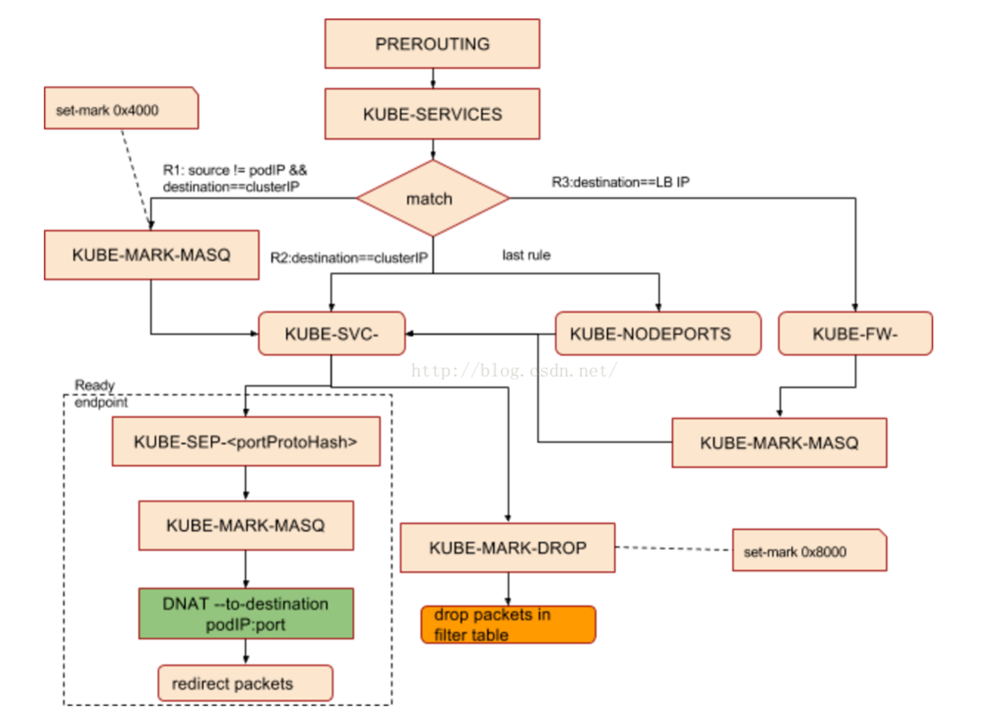

# K8s部署的实践

[TOC]

> 背景：K8s的全称是Kubernetes，是一个开源的容器编排引擎，用来对容器化应用进行自动化部署、 扩缩和管理。有关官方的说明文档，请参考：[Kubernetes 中文文档](https://kubernetes.io/zh-cn/docs/home/)。由于该项目的版本更新速度非常快，很多时候之前可能能够正常部署好的一套流程，一段时候就就需要适度调整，所以一切请以官方文档为主。

### 一、使用kubeadm安装并部署k8s集群

关于使用kubeadm安装并部署k8s集群，[官方文档](https://kubernetes.io/zh-cn/docs/setup/production-environment/tools/kubeadm/create-cluster-kubeadm/)已经有了非常详细的解释，但是其实仔细研究就会发现逻辑比较混乱，这里小小的点评一下，经常就是让我从一个文档跳跃到另一个文档，然后又跳跃不知道多少个文档之后才回来。例如，当我阅读[主机准备](https://kubernetes.io/zh-cn/docs/setup/production-environment/tools/kubeadm/create-cluster-kubeadm/#preparing-the-hosts)这个章节的时候，就分别要跳转到安装[容器运行时](https://kubernetes.io/zh-cn/docs/setup/production-environment/container-runtimes)和[安装 kubeadm](https://kubernetes.io/zh-cn/docs/setup/production-environment/tools/kubeadm/install-kubeadm/)，而且我严重怀疑这个东西的翻译是机器翻译的。所以我这里按照正常的逻辑，以阿里云为例子介绍，其他云平台（例如交大的jCloud或者腾讯云大同小异）

> 此外，网络上的很多教程在讲述部署K8s的时候，要目忽视了容器运行时这个关键的名词，要目就只给操作，但是不说是在`worker`还是`master`节点执行的。所以我这个文档会尽可能详细

#### a）主机准备和购买

为了能够清晰的部署出Worker节点和Master节点，至少需要准备两台服务器（配置：2核心CPU、2GB内存或者更高的配置，并保证他们之间能够互相连通，具体方法是Ping对方的IP，能够收集到数据包就说明正常工作。）

进入[阿里云ECS购买页面](https://ecs-buy.aliyun.com/)，选择服务器，具体配置如下：

- 付费模式：抢占式实例（对于部署的开发者来说节约成本）
- 地域及可用区：新加坡（选择国外节约配置换源的步骤，部署起来更加方便）
- 机器类型：共享计算型n4
- 抢占式实例使用时长：无确定使用时长
- 单台实例规格上限价：使用自动出价
- 购买实例数量：2台
- 镜像：Ubuntu 22.04 64位（提示：如果使用的是Ubuntu 20.04 在后面安装的时候可能需要新建一个`etc/apt/` 下面的目录）
- 存储：高效云盘 20GB
- 公网IP：分配公网IPv4地址勾选，按照使用流量付费，带宽5M

其他的采用默认的网络设置、系统配置、分组设置，直接快进到确认订单。

#### b）主机名修改（两台分别执行）

在操作一栏选择修改实例主机名，在HostName一栏下面，把第一台主机的实例名称、Hostname都修改为：`k8s-master`，把第二台主机的实例名称、Hostname都修改为：`k8s-worker`，修改完成后，**重启两台主机生效。**这样也方便我们的后续管理


#### c）编辑本地DNS（两台分别执行）

首先，在控制台面板上查看，两台ECS的内网IP分别：

- `k8s-master`：172.24.230.81
- `k8s-worker`：172.24.230.80

那么，登陆到`k8s-master`服务器，执行

```bash
sudo nano /etc/hosts
```

然后增加一行：

```
172.24.230.80   k8s-worker      k8s-worker
```

然后，登陆到`k8s-worker`服务器，执行

```bash
sudo nano /etc/hosts
```

然后在文件末尾增加一行：

```
172.24.230.81   k8s-master      k8s-master
```

然后分别在两台机器上执行：

```
ping k8s-master
ping k8s-worker
```

需要两台机器都能出现如下的结果，代表本地DNS修改成功，且两台机器可以互通：

```shell
ecs-assist-user@k8s-worker:~$ ping k8s-master
PING k8s-master (172.24.230.81) 56(84) bytes of data.
64 bytes from k8s-master (172.24.230.81): icmp_seq=1 ttl=64 time=0.221 ms
64 bytes from k8s-master (172.24.230.81): icmp_seq=2 ttl=64 time=0.180 ms
64 bytes from k8s-master (172.24.230.81): icmp_seq=3 ttl=64 time=0.177 ms
^C
--- k8s-master ping statistics ---
3 packets transmitted, 3 received, 0% packet loss, time 2045ms
rtt min/avg/max/mdev = 0.177/0.192/0.221/0.020 ms
ecs-assist-user@k8s-worker:~$ ping k8s-worker
PING k8s-worker (172.24.230.80) 56(84) bytes of data.
64 bytes from iZt4n25yj6nsbwerr0qxakZ (172.24.230.80): icmp_seq=1 ttl=64 time=0.026 ms
64 bytes from iZt4n25yj6nsbwerr0qxakZ (172.24.230.80): icmp_seq=2 ttl=64 time=0.046 ms
64 bytes from iZt4n25yj6nsbwerr0qxakZ (172.24.230.80): icmp_seq=3 ttl=64 time=0.038 ms
^C
--- k8s-worker ping statistics ---
3 packets transmitted, 3 received, 0% packet loss, time 2047ms
rtt min/avg/max/mdev = 0.026/0.036/0.046/0.008 ms
```

#### d）安装Docker（两台都一样执行）

> 首先说一下为什么要安装docker，其实K8s的部署有三种容器运行时，只要选择一种即可：containerd、CRI-O、还有Docker Engine，只有使用Docker引擎作为容器运行时，才可以用`docker ps`来查看master和worker节点所有正常运行的docker容器，这也是根据作业要求。由于K8s的更新版本很快，所以之前可能可以直接使用docker作为容器运行时的，**现在又多出了额外的配置步骤**，因此网络上可能部分教程都已经失效。再次，我也提倡：官方文档是学习一个新产品的最佳方法。

> 再解释一个问题：不安装docker可不可以使用K8s集群呢？答案是可以的，本教程就是基于docker作为CRI容器运行时来安装，当然也可以选择其他的容器运行时。但是，**K8s的启动原理是扫描所有的可能的容器运行时套接字，如果机器上安装了多个容器运行时，必须在启动的时候指定特别使用哪一个容器运行时，才可以正常初始化K8s，这个我们后面再解释。**

安装Docker参考官方文档，不要使用`sudo apt-get install docker.io`，因为这样安装的版本可能比较老旧，会导致后面出现很多问题。安装的所有代码我都合并在下面了，注释是解释，两台机器都需要执行安装docker的操作。

```
# 如果已有docker安装，那就卸载
sudo apt-get remove docker docker-engine docker.io containerd runc
# 更新apt的源，常规操作
sudo apt-get update
# 安装依赖，其中CA的那个是证书，保证后面引入的时候不会报错证书不信任
sudo apt-get install \
    ca-certificates \
    curl \
    gnupg \
    lsb-release

# 这一步是为了适应ubuntu 20.04之前的版本，之前没有这个文件夹
sudo mkdir -m 0755 -p /etc/apt/keyrings
# 导入密钥，确保后续可以从docker官方的源拉安装包
curl -fsSL https://download.docker.com/linux/ubuntu/gpg | sudo gpg --dearmor -o /etc/apt/keyrings/docker.gpg

# 添加docker的源
echo \
  "deb [arch=$(dpkg --print-architecture) signed-by=/etc/apt/keyrings/docker.gpg] https://download.docker.com/linux/ubuntu \
  $(lsb_release -cs) stable" | sudo tee /etc/apt/sources.list.d/docker.list > /dev/null
# 更新docker的源
sudo apt-get update
# 国际惯例安装，不多说
sudo apt-get install docker-ce docker-ce-cli containerd.io docker-buildx-plugin docker-compose-plugin

# 然后我们需要改一下，把当前用户（非root）添加到docker的用户组里面
# 这样不需要sudo就可以执行了
# 根据用户名，我的用户名是ecs-assist-user
# 阿里云平台似乎USER这个环境变量有些异常，所以
# 所以执行 sudo usermod -aG docker ecs-assist-user
sudo usermod -aG docker ${USER}
# 之后为了生效，需要重新启动云服务器！

```

重启容器之后，测试一下，看看是否当前用户也可以运行hello-world容器

```
docker run hello-world
```

#### d）转发IPv4（两台都一样执行）

转发IPv4 并让 iptables 看到桥接流量 

```shell
cat <<EOF | sudo tee /etc/modules-load.d/k8s.conf
overlay
br_netfilter
EOF

sudo modprobe overlay
sudo modprobe br_netfilter

# 设置所需的 sysctl 参数，参数在重新启动后保持不变
cat <<EOF | sudo tee /etc/sysctl.d/k8s.conf
net.bridge.bridge-nf-call-iptables  = 1
net.bridge.bridge-nf-call-ip6tables = 1
net.ipv4.ip_forward                 = 1
EOF

# 应用 sysctl 参数而不重新启动
sudo sysctl --system
```

通过运行以下指令确认 `br_netfilter` 和 `overlay` 模块被加载：

```bash
lsmod | grep br_netfilter
lsmod | grep overlay
```

通过运行以下指令确认 `net.bridge.bridge-nf-call-iptables`、`net.bridge.bridge-nf-call-ip6tables` 和 `net.ipv4.ip_forward` 系统变量在你的 `sysctl` 配置中被设置为 1：

```bash
sysctl net.bridge.bridge-nf-call-iptables net.bridge.bridge-nf-call-ip6tables net.ipv4.ip_forward
```

#### e）安装Docker CRI（两台都一样执行）

互联网上很多的教程实现都是这个原因：cri-dockerd被移除。

> Docker Engine 没有实现 [CRI](https://kubernetes.io/zh-cn/docs/concepts/architecture/cri/)， 而这是容器运行时在 Kubernetes 中工作所需要的。 为此，必须安装一个额外的服务 [cri-dockerd](https://github.com/Mirantis/cri-dockerd)。 cri-dockerd 是一个基于传统的内置 Docker 引擎支持的项目， 它在 1.24 版本从 kubelet 中[移除](https://kubernetes.io/zh-cn/dockershim)。

安装也很简单，命令来源于官网，如下，需要编译一个Go的程序：

```shell
# 切换到root身份
sudo su
cd

# 安装Go
wget https://storage.googleapis.com/golang/getgo/installer_linux
chmod +x ./installer_linux
./installer_linux
# 这一句是添加到环境变量
source ~/.bash_profile
# 克隆仓库
git clone https://github.com/Mirantis/cri-dockerd.git
cd cri-dockerd
mkdir bin
# 这一步编译的时间可能稍微要长一点，如果4c8g可能会更快
go build -o bin/cri-dockerd
mkdir -p /usr/local/bin
install -o root -g root -m 0755 bin/cri-dockerd /usr/local/bin/cri-dockerd
cp -a packaging/systemd/* /etc/systemd/system
sed -i -e 's,/usr/bin/cri-dockerd,/usr/local/bin/cri-dockerd,' /etc/systemd/system/cri-docker.service
systemctl daemon-reload
systemctl enable cri-docker.service
systemctl enable --now cri-docker.socket

# 现在可以退出root啦
exit
```

#### f）安装 kubelet、kubeadm 和 kubectl（两台都一样执行）

通过apt安装相关的包，根据官网来源。

```shell
sudo apt-get update
sudo apt-get install -y apt-transport-https ca-certificates curl
sudo curl -fsSLo /etc/apt/keyrings/kubernetes-archive-keyring.gpg https://packages.cloud.google.com/apt/doc/apt-key.gpg
echo "deb [signed-by=/etc/apt/keyrings/kubernetes-archive-keyring.gpg] https://apt.kubernetes.io/ kubernetes-xenial main" | sudo tee /etc/apt/sources.list.d/kubernetes.list
sudo apt-get update
sudo apt-get install -y kubelet kubeadm kubectl

sudo apt-mark hold kubelet kubeadm kubectl
```

#### g）在master节点初始化（仅master执行）

如果你现在直接执行：

```shell
sudo kubeadm init
```

就会看到下面的报错：

```shell
ecs-assist-user@k8s-worker:~$ sudo kubeadm init
Found multiple CRI endpoints on the host. Please define which one do you wish to use by setting the 'criSocket' field in the kubeadm configuration file: unix:///var/run/containerd/containerd.sock, unix:///var/run/cri-dockerd.sock
To see the stack trace of this error execute with --v=5 or higher
```

> 这是因为初始化的时候，扫描到多个容器运行时，所以报错，需要制定特定的容器运行时。

执行带有制定容器运行时的初始化命令，应该就可以了！

```shell
sudo kubeadm init --cri-socket unix:///var/run/cri-dockerd.sock
```

现在我们发现已经初始化完成了！但是不要急，还有后面的几个操作需要进行。


根据输出提示，执行下面的语句，创建配置目录文件。

```
  mkdir -p $HOME/.kube
  sudo cp -i /etc/kubernetes/admin.conf $HOME/.kube/config
  sudo chown $(id -u):$(id -g) $HOME/.kube/config
```

然后需要**安装网络插件**：weave，根据官网[Integrating Kubernetes via the Addon (weave.works)](https://www.weave.works/docs/net/latest/kubernetes/kube-addon/)说明

```
kubectl apply -f https://github.com/weaveworks/weave/releases/download/v2.8.1/weave-daemonset-k8s.yaml
```

稍等片刻，等待出现下面的内容，即可完成：

```
ecs-assist-user@k8s-master:~$ kubectl apply -f https://github.com/weaveworks/weave/releases/download/v2.8.1/weave-daemonset-k8s.yaml
serviceaccount/weave-net created
clusterrole.rbac.authorization.k8s.io/weave-net created
clusterrolebinding.rbac.authorization.k8s.io/weave-net created
role.rbac.authorization.k8s.io/weave-net created
rolebinding.rbac.authorization.k8s.io/weave-net created
daemonset.apps/weave-net created
```

然后我们拷贝下，这是我们需要在另外一台机器执行的命令：

```
kubeadm join 172.24.230.81:6443 --token pipov2.saeiovrucru8272n \
        --discovery-token-ca-cert-hash sha256:22a24a977727893ba7e17b4fb476ee14a7e3e746b02e7e9d0a536b74fe856040 
```

#### h）在worker节点加入集群（仅worker执行）

> 和刚才一样，必须制定容器运行时，才能正常启动，否则一样报错。

```
kubeadm join 172.24.230.81:6443 --cri-socket unix:///var/run/cri-dockerd.sock --token pipov2.saeiovrucru8272n \
        --discovery-token-ca-cert-hash sha256:22a24a977727893ba7e17b4fb476ee14a7e3e746b02e7e9d0a536b74fe856040 
```


安装完成后的情况，如下所示，此时由于worker还没有分配角色，所以显示的为none。到此为止部署全部完成。


#### i）添加Role

添加role的语法如下，所以按照课程要求：

```shell
# 语法 减号就是删除roles，等号就是增加roles
kubectl label nodes 节点名字 node-role.kubernetes.io/worker(=/-)
# 
kubectl label nodes k8s-master node-role.kubernetes.io/master=
kubectl label nodes k8s-worker node-role.kubernetes.io/worker=
```

现在已经可以看到效果了！


### 二、回答问题

#### a) 问题一

> 请记录所有安装步骤的指令，并简要描述其含义

回答：请参考第一部分的所有内容，已经有很详细的解释。

#### b) 问题二

> 在两个节点上分别使用 ps aux | grep kube 列出所有和k8s相关的进程，记录其输出，并简要说明各个进程的作用。

回答：在master节点的截图如下：


在worker的节点的截图如下：


具体功能解释如下：

- `kube-controller-manager`：Kubernetes 控制器管理器是一个守护进程，内嵌随 Kubernetes 一起发布的核心控制回路。 在机器人和自动化的应用中，控制回路是一个永不休止的循环，用于调节系统状态。 在 Kubernetes 中，每个控制器是一个控制回路，通过 API 服务器监视集群的共享状态， 并尝试进行更改以将当前状态转为期望状态。 （官方解释）
- `kube-scheduler`：Kubernetes 调度器是一个控制面进程，负责将 Pods 指派到节点上。 调度器基于约束和可用资源为调度队列中每个 Pod 确定其可合法放置的节点。 调度器之后对所有合法的节点进行排序，将 Pod 绑定到一个合适的节点。 在同一个集群中可以使用多个不同的调度器；kube-scheduler 是其参考实现。（官方解释）
- `kube-apiserver`：Kubernetes API 服务器验证并配置 API 对象的数据， 这些对象包括 pods、services、replicationcontrollers 等。 API 服务器为 REST 操作提供服务，并为集群的共享状态提供前端， 所有其他组件都通过该前端进行交互。 （官方解释）
- `kubelet`：kubelet 是在每个 Node 节点上运行的主要 “节点代理”。它可以使用以下之一向 apiserver 注册： 主机名（hostname）；覆盖主机名的参数；某云驱动的特定逻辑。 （官方解释）
- `kube-proxy`：Kubernetes 网络代理在每个节点上运行。网络代理反映了每个节点上 Kubernetes API 中定义的服务，并且可以执行简单的 TCP、UDP 和 SCTP 流转发，或者在一组后端进行循环 TCP、UDP 和 SCTP 转发。 （官方解释）
- `kube-utils`：weave 的 Pod 网络插件，用于部署节点网络到集群中。

#### c) 问题三

> 在两个节点中分别使用 `docker ps` 显示所有正常运行的docker容器，记录其输出，并简要说明各个 容器所包含的k8s组件，以及那些k8s组件未运行在容器中。

这个是master节点的执行结果（显然直接看主机名嘛）


显然，相比之下worker的容器就要少了很多。


- `pause`相关的容器：负责网络命名空间、网络通信和管理的功能
- `etcd`相关的容器：维持整个分布式系统的数据的一致性
- `wave`相关容器：由于我使用的网络插件是`wave`，所以会有这些容器

- 还没发现哪个k8s组件不运行在容器 docker中的。

### 三、部署Pod方法问题

根据要求我们需要部署两个镜像到一个Pod中。

| 容器镜像                       | 简要描述                                                     | 主要端口                                             | 主要目录                                            |
| ------------------------------ | ------------------------------------------------------------ | ---------------------------------------------------- | --------------------------------------------------- |
| dplsming/nginxfileserver:1.0   | 文件目录共享服务。利 用nginx服务器，将主 要目录下的所有文件以 http协议对外共享 | 80：http 服务器访 问端口                             | /usr/share/nginx/html/files： nginx向外共享的根目录 |
| dplsming/aria2ngdownloader:1.0 | 文件下载服务。基于开 源项目轻微改动而来， 利用aria2完成下载功 能，并利用dark-httpd 和aria2-ng为aria2提供 了一个基于web页面的 简单UI | 6800： aria2c的 rpc控制端 口， 6880： webUI访 问端口 | /data：默认的下载文件存储目 录                      |

请将上述两个镜像部署到同一个Pod中，暴露nginx-fileserver镜像所对应容器（后简称viewer）的80端口aria2ng-downloader镜像所对应容器（后简称downloader）的6800、6880端口，并使得viewer的目录/usr/share/nginx/html/files和downloader的目录 /data 下的所有文件均为两个容器所共 享的。基于部署Pod的过程，回答下述问题：

#### a) 问题一

> 请采用声明式接口对Pod进行部署，并将部署所需的yml文件记录在实践文档中

特别注意这里的：`labels`是不可缺少的，不然后面部署服务的时候没办法用选择器。

```yaml
apiVersion: v1
kind: Pod
metadata:
  name: mypod
  labels: 
    app: mypod
spec:
  containers:
    - name: nginx
      image: dplsming/nginx-fileserver:1.0
      ports:
        - containerPort: 80
      volumeMounts:
        - name: share-volume
          mountPath: /usr/share/nginx/html/files
    - name: aria2
      image: dplsming/aria2ng-downloader:1.0
      ports:
      - containerPort: 6800
      - containerPort: 6880
      volumeMounts:
        - name: share-volume
          mountPath: /data
  volumes:
    - name: share-volume
      hostPath:
        path: /home/ecs-assist-user/mountData
        type: DirectoryOrCreate
```

然后执行下面的命令(应用配制文件然后获取部署情况)：

```
kubectl apply -f ./k8s.yaml
kubectl get pod
```

可以看到部署的过程有一段时间，一段时间后Ready！


#### b) 问题二

> 请在worker节点上，在部署Pod的前后分别采用 docker ps 查看所有运行中的容器并对比两者的区 别。请将创建该Pod所创建的全部新容器列举出来，并一一解释其作用

Master节点的就没有变化，说明没有部署到Master节点上面。


Worker节点的就变成这样了，多了几个容器，他们的创建时间明显要晚于其他容器：


可以看出，一个容器是nginx-fileserver，另外一个容器是aria2ng-downloader，而还有一个容器Pause则用来维持整个Pod。

#### c) 问题三

> 请结合[博客](https://blog.51cto.com/u_15069443/4043930) 的内容，将容器中的veth与host机器上 的veth匹配起来，并采用 ip link 和 ip addr 指令找到位于host机器中的所有网络设备及其之间的关系。结合两者的输出，试绘制出worker节点中涉及新部署Pod的所有网络设备和其网络结构，并在图中标注出从master节点中使用cluster ip访问位于worker节点中的Pod的网络路径

首先Nginx那个容器，里面没有安装网络工具，先安装一下。`XXXXXXXXX`是容器的ID。然后分别进入容器，执行`ip addr`命令，即可查看所有的网络信息。因为信息很少，所以也没有很大的必要过滤了！

```
docker exec -it XXXXXXXXX bash
apt-get update 
apt-get install -y iproute2
```

##### 1) aria2的网络信息

```
ecs-assist-user@k8s-worker:~$ docker exec -it ccc6b72b3893 ip addr # aria2
1: lo: <LOOPBACK,UP,LOWER_UP> mtu 65536 qdisc noqueue state UNKNOWN qlen 1000
    link/loopback 00:00:00:00:00:00 brd 00:00:00:00:00:00
    inet 127.0.0.1/8 scope host lo
       valid_lft forever preferred_lft forever
11: eth0@if12: <BROADCAST,MULTICAST,UP,LOWER_UP,M-DOWN> mtu 1376 qdisc noqueue state UP 
    link/ether 2e:5d:63:fa:80:e5 brd ff:ff:ff:ff:ff:ff
    inet 10.44.0.1/12 brd 10.47.255.255 scope global eth0
       valid_lft forever preferred_lft forever
```

##### 2) Nginx的网络信息

```
root@mypod:/# ip addr
1: lo: <LOOPBACK,UP,LOWER_UP> mtu 65536 qdisc noqueue state UNKNOWN group default qlen 1000
    link/loopback 00:00:00:00:00:00 brd 00:00:00:00:00:00
    inet 127.0.0.1/8 scope host lo
       valid_lft forever preferred_lft forever
11: eth0@if12: <BROADCAST,MULTICAST,UP,LOWER_UP> mtu 1376 qdisc noqueue state UP group default 
    link/ether 2e:5d:63:fa:80:e5 brd ff:ff:ff:ff:ff:ff link-netnsid 0
    inet 10.44.0.1/12 brd 10.47.255.255 scope global eth0
       valid_lft forever preferred_lft forever
```

##### 3) 主机的网络信息

主机的网络信息要多一点，如下，后面再说具体看的是哪里。

```
ecs-assist-user@k8s-worker:~$ ip addr
1: lo: <LOOPBACK,UP,LOWER_UP> mtu 65536 qdisc noqueue state UNKNOWN group default qlen 1000
    link/loopback 00:00:00:00:00:00 brd 00:00:00:00:00:00
    inet 127.0.0.1/8 scope host lo
       valid_lft forever preferred_lft forever
    inet6 ::1/128 scope host 
       valid_lft forever preferred_lft forever
2: eth0: <BROADCAST,MULTICAST,UP,LOWER_UP> mtu 1500 qdisc fq_codel state UP group default qlen 1000
    link/ether 00:16:3e:0a:5b:91 brd ff:ff:ff:ff:ff:ff
    altname enp0s3
    altname ens3
    inet 172.24.230.82/20 metric 100 brd 172.24.239.255 scope global dynamic eth0
       valid_lft 315359309sec preferred_lft 315359309sec
    inet6 fe80::216:3eff:fe0a:5b91/64 scope link 
       valid_lft forever preferred_lft forever
3: docker0: <NO-CARRIER,BROADCAST,MULTICAST,UP> mtu 1500 qdisc noqueue state DOWN group default 
    link/ether 02:42:15:c9:82:82 brd ff:ff:ff:ff:ff:ff
    inet 172.17.0.1/16 brd 172.17.255.255 scope global docker0
       valid_lft forever preferred_lft forever
4: datapath: <BROADCAST,MULTICAST,UP,LOWER_UP> mtu 1376 qdisc noqueue state UNKNOWN group default qlen 1000
    link/ether da:cf:4a:4e:0e:2b brd ff:ff:ff:ff:ff:ff
    inet6 fe80::d8cf:4aff:fe4e:e2b/64 scope link 
       valid_lft forever preferred_lft forever
6: weave: <BROADCAST,MULTICAST,UP,LOWER_UP> mtu 1376 qdisc noqueue state UP group default qlen 1000
    link/ether ba:ed:0b:e4:80:a7 brd ff:ff:ff:ff:ff:ff
    inet 10.44.0.0/12 brd 10.47.255.255 scope global weave
       valid_lft forever preferred_lft forever
    inet6 fe80::b8ed:bff:fee4:80a7/64 scope link 
       valid_lft forever preferred_lft forever
8: vethwe-datapath@vethwe-bridge: <BROADCAST,MULTICAST,UP,LOWER_UP> mtu 1376 qdisc noqueue master datapath state UP group default 
    link/ether ca:fe:87:c2:69:e1 brd ff:ff:ff:ff:ff:ff
    inet6 fe80::14bb:6aff:fe7d:6223/64 scope link 
       valid_lft forever preferred_lft forever
9: vethwe-bridge@vethwe-datapath: <BROADCAST,MULTICAST,UP,LOWER_UP> mtu 1376 qdisc noqueue master weave state UP group default 
    link/ether f6:fb:cb:5c:8b:73 brd ff:ff:ff:ff:ff:ff
    inet6 fe80::2c5f:ccff:fe5a:66b4/64 scope link 
       valid_lft forever preferred_lft forever
10: vxlan-6784: <BROADCAST,MULTICAST,UP,LOWER_UP> mtu 65535 qdisc noqueue master datapath state UNKNOWN group default qlen 1000
    link/ether d6:be:66:8e:5d:20 brd ff:ff:ff:ff:ff:ff
    inet6 fe80::6c4c:2dff:fe80:563/64 scope link 
       valid_lft forever preferred_lft forever
12: vethwepl8d4e644@if11: <BROADCAST,MULTICAST,UP,LOWER_UP> mtu 1376 qdisc noqueue master weave state UP group default 
    link/ether 56:53:ea:28:04:80 brd ff:ff:ff:ff:ff:ff link-netnsid 0
    inet6 fe80::5453:eaff:fe28:480/64 scope link 
       valid_lft forever preferred_lft forever
```

我们知道Docker容器之间的通讯是通过Docker0这个网桥实现的，但是！我们这里看一下上面输出的内容：状态是出于Down的状态，所以应该是不参与网络的。

```
3: docker0: <NO-CARRIER,BROADCAST,MULTICAST,UP> mtu 1500 qdisc noqueue state DOWN group default 
    link/ether 02:42:15:c9:82:82 brd ff:ff:ff:ff:ff:ff
    inet 172.17.0.1/16 brd 172.17.255.255 scope global docker0
       valid_lft forever preferred_lft forever
```

这里就是`veth-pair`技术，是一对虚拟的网络设备接口，他们成对出现。一端链接主机，一端链接容器，这样他们直接就可以通讯了。

我们上面在主机执行的时候，看到的是`12: vethwepl8d4e644@if11`，11是他pair配对的veth的index，也就是对应的我们部署的两个容器的里面的`11: eth0@if12`，显然两这顺序正好相反。

然后我们知道，同一个网段的设备可以互相直接通讯，查看IP，我们就可以很轻松的找到weave网络插件的那一个虚拟网卡。由于题目问到的是使用clusterIP访问的路径，显然离不开这台服务器自带的虚拟网卡（对应服务器的内网IP），那就是`eth0`。

画拓扑图如下：


### 四、部署 Service

#### a) 问题一

> 请采用声明式接口对 Service 进行部署，并将部署所需的 yaml 文件记录在实践文档中。

- 注意：name这种东西都不能有大小写混合，必须全部小写字母
- 选择器selector里面必须要配制app的名字，这也就是要求之前部署pod的时候必须指定名字，否则部署服务的时候没办法区分pod！

```yaml
apiVersion: v1
kind: Service
metadata:
  name: myservice
spec:
  selector:
    app: mypod
  ports:
    - port: 80
      targetPort: 80
      name: nginx
    - port: 6800
      targetPort: 6800
      name: aria2-rpc
    - port: 6880
      targetPort: 6880
      name: aria2-web-ui
```

部署命令和检查命令：

```
kubectl apply -f ./service.yaml
kubectl get service
# 执行完成后应该可以看到在集群里面的IP地址
# 尝试访问
curl 10.110.97.230
```


验证的结果：


#### b) 问题二

> 请在 master 节点中使用 `iptables-save` 指令输出所有的 iptables 规则，将其中与 Service 访问相关的 iptable 规则记录在实践文档中，并解释网络流量是如何采用基于 iptables 的方式被从对 Service 的 cluster IP 的访问定向到实际的 Pod 中。

因为我上面在起名的时候，服务名名词叫做`myservice`，所以

```
sudo iptables-save | grep myservice
```


- 首先 `KUBE-SERVICES`：是最外层的，暴露服务的端口，我们可以看到`10.110.97.230`暴露出来的`clusterIP`。然后把请求转发到`KUBE-SVC-XXXXXX`
- `KUBE-SEP` 表示的是 `KUBE-SVC` 对应的终端，经过该链的所有 TCP 报文的DNAT到10.44.0.1。



#### c) 问题三

> kube-proxy 组件在整个 Service 的定义与实现过程中起到了什么作用？请自行查找资料，并解释在 iptables 模式下，kube-proxy 的功能。

kube-proxy是Kubernetes的核心组件，部署在每个Node节点上，它是实现Kubernetes Service的通信与负载均衡机制的重要组件; kube-proxy负责为Pod创建代理服务，从apiserver获取所有server信息，并根据server信息创建代理服务，实现server到Pod的请求路由和转发，从而实现K8s层级的虚拟转发网络。具体的功能如下：

- kube-proxy负责为Service提供cluster内部的服务发现和负载均衡，它运行在每个Node计算节点上，负责Pod网络代理, 
- 定时从etcd服务获取到service信息来做相应的策略，维护网络规则和四层负载均衡工作。
- 管理service的访问入口，包括集群内Pod到Service的访问和集群外访问service。
- 管理sevice的Endpoints，该service对外暴露一个Virtual IP，也成为Cluster IP, 集群内通过访问这个Cluster IP:Port就能访问到集群内对应的serivce下的Pod。

kube-proxy也会维护node节点上的防火墙规则和路由规则，在 iptables 模式下，会根据 Service 以及 endpoints 对象的改变实时刷新规则。

### 五、使用Deployment为Pod创建备份

#### a) 问题一

配置文件如下。

```yaml 
kind: Deployment
metadata:
  name: mydeployoment
  labels:
    app:myapp
spec:
  replicas: 3
  selector:
    matchLabels:
    app: nginx-aria2
        template:
          metadata:
           labels:
             app: myapp
    spec:
      containers:
        - name: nginx
          images: dplsming/nginx-fileserver:1.0
          ports:
            - containerPort: 80
          volumeMounts:
            - name: share-volume
              mountPath: /usr/share/nginx/html/files
        - name: aria2
          image: dplsming/aria2ng-downloader:1.0
          ports:
            - containerPort: 6800
            - containerPort: 6880
          volumeMounts:
            - name: share-volume
              mountPath: /data
      volumes:
        - name: share-volume
          hostPath:
            path: /home/ecs-assist-user/mountData
            type: DirectoryOrCreate
```

```
kubectl apply -f ./dep.yarm
kubectl get deployment
```


修改service部署的时候的yaml文件，然后再部署，即可打印出下面的信息。

```
ecs-assist-user@k8s-master:~/k8s$ kubectl describe svc myservice
Name:              myservice
Namespace:         default
Labels:            <none>
Annotations:       <none>
Selector:          app=myapp
Type:              ClusterIP
IP Family Policy:  SingleStack
IP Families:       IPv4
IP:                10.103.145.8
IPs:               10.103.145.8
Port:              nginx  80/TCP
TargetPort:        80/TCP
Endpoints:         10.44.0.1:80,10.44.0.2:80,10.44.0.3:80
Port:              aria2-rpc  6800/TCP
TargetPort:        6800/TCP
Endpoints:         10.44.0.1:6800,10.44.0.2:6800,10.44.0.3:6800
Port:              aria2-web-ui  6880/TCP
TargetPort:        6880/TCP
Endpoints:         10.44.0.1:6880,10.44.0.2:6880,10.44.0.3:6880
Session Affinity:  None
Events:            <none>
```

#### b) 问题二

> 请在 master 节点中使用 iptables-save 指令输出所有的 iptables 规则，将其中与 Service 访问相关的 iptables 规则记录在实践文档中，并解释网络流量是如何采用基于 iptables 的方式被从对 Service 的 ClusterIP 的访问，以随机且负载均衡的方式，定向到 Deployment 所创建的实际的 Pod 中的。

```
sudo iptables-save | grep myservice
```

结果如下图，明显可以看到多出来的按照概率转发。


再来解释网络流量如何转发的：

- 通过 ClusterIP 访问相应 Service 的时候，流量会从KUBE-SERVICES转发到KUBE-SVC-XXXX

- KUBE-SVC-XXXX在这条链路上面，是实现复杂均衡的关键

  ```
  -A KUBE-SVC-RJ6ZHYDYBPV4X2XM -m comment --comment "default/myservice:aria2-rpc -> 10.44.0.1:6800" -m statistic --mode random --probability 0.33333333349 -j KUBE-SEP-RH2Y64YCI4LLR756
  -A KUBE-SVC-RJ6ZHYDYBPV4X2XM -m comment --comment "default/myservice:aria2-rpc -> 10.44.0.2:6800" -m statistic --mode random --probability 0.50000000000 -j KUBE-SEP-UP4JYHNYSMM42YRS
  -A KUBE-SVC-RJ6ZHYDYBPV4X2XM -m comment --comment "default/myservice:aria2-rpc -> 10.44.0.3:6800" -j KUBE-SEP-X22M4SZKBYRDLSB6
  ```

- 仔细查看，三条规则是按照顺序来的，第一条命中的概率是三分之一，如果第一条没有命中，那么第二条命中的概率是0.5，如果第二条没有命中，那么第三条也就是最后一条是百分之百命中的

- 于是乎，通过IPtable，就可以实现负载均衡，这种均衡是随机的负载均衡，不是基于IP-Hash，也不是顺序轮转

- 之后，交给了KUBE-SEP-XXXXX，然后流量在交给对应的Pod，这和我们刚才解释的都是一样的，就不多说啦

#### c) 问题三

> 该使用 Deployment 的部署方式下，不同 Pod 之间的文件是否共享？该情况会在实际使用文件下载与共享服务时产生怎样的实际效果与问题？应如何解决这一问题？

- 默认情况下容器的文件系统是互相隔离的，但是我们声明了Volume，把文件夹挂在了宿主机下面，所以实际上挂载的那一部分的目录是共享的。
- 会导致文件名可能冲突，一个用户可以下载到别人的文件，导致安全性问题增加。使用持久化卷，也就是**PersistentVolume**可以解决这些问题。他是对底层共享存储的一种抽象，将共享存储定义为一种资源，它属于集群级别资源，不属于任何Namespace，用户使用 PV 需要通过 PVC 申请。PV 是由管理员进行创建和配置，它和具体的底层的共享存储技术的实现方式有关，比如说 Ceph、GlusterFS、NFS 等，都是通过插件机制完成与共享存储的对接，且根据不同的存储 PV 可配置参数也是不相同。
