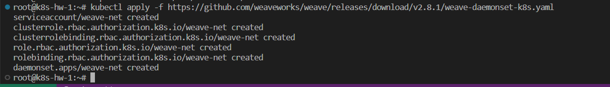
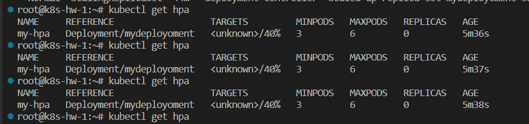
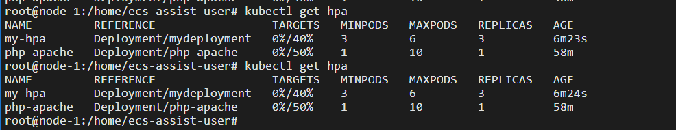
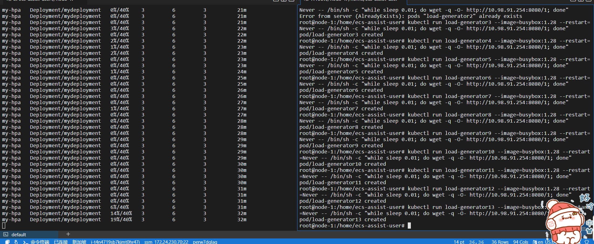

# K8s实践作业

[TOC]

## 搭建过程和命令

### 步骤一 转发IPv4

转发IPv4 并让 iptables 看到桥接流量 

```shell
cat <<EOF | sudo tee /etc/modules-load.d/k8s.conf
overlay
br_netfilter
EOF

sudo modprobe overlay
sudo modprobe br_netfilter

# 设置所需的 sysctl 参数，参数在重新启动后保持不变
cat <<EOF | sudo tee /etc/sysctl.d/k8s.conf
net.bridge.bridge-nf-call-iptables  = 1
net.bridge.bridge-nf-call-ip6tables = 1
net.ipv4.ip_forward                 = 1
EOF

# 应用 sysctl 参数而不重新启动
sudo sysctl --system
```

通过运行以下指令确认 `br_netfilter` 和 `overlay` 模块被加载：

```bash
lsmod | grep br_netfilter
lsmod | grep overlay
```

通过运行以下指令确认 `net.bridge.bridge-nf-call-iptables`、`net.bridge.bridge-nf-call-ip6tables` 和 `net.ipv4.ip_forward` 系统变量在你的 `sysctl` 配置中被设置为 1：

```bash
sysctl net.bridge.bridge-nf-call-iptables net.bridge.bridge-nf-call-ip6tables net.ipv4.ip_forward
```

### 步骤二 安装K8s

通过apt安装相关的包，根据作业文档里面提供的镜像网站。

```shell
sudo apt-get update

sudo apt-get install -y apt-transport-https ca-certificates curl

sudo curl -fsSLo /etc/apt/keyrings/kubernetes-archive-keyring.gpg https://mirrors.aliyun.com/kubernetes/apt/doc/apt-key.gpg

echo "deb [signed-by=/etc/apt/keyrings/kubernetes-archive-keyring.gpg] https://mirrors.aliyun.com/kubernetes/apt/ kubernetes-xenial main" | sudo tee /etc/apt/sources.list.d/kubernetes.list

sudo apt-get update

sudo apt-get install -y kubelet kubeadm kubectl

sudo apt-mark hold kubelet kubeadm kubectl
```

### 步骤三 安装crictl

(参考：https://kubernetes.io/zh-cn/docs/tasks/debug/debugcluster/crictl/)的配置⽂件，安装配置crictl。

查看官方的仓库：[kubernetes-sigs/cri-tools: CLI and validation tools for Kubelet Container Runtime Interface (CRI) . (github.com)](https://github.com/kubernetes-sigs/cri-tools)

然后安装，目前最新的版本是v1.27.0

```
VERSION="v1.27.0"
wget https://github.com/kubernetes-sigs/cri-tools/releases/download/$VERSION/crictl-$VERSION-linux-amd64.tar.gz
sudo tar zxvf crictl-$VERSION-linux-amd64.tar.gz -C /usr/local/bin
rm -f crictl-$VERSION-linux-amd64.tar.gz

VERSION="v1.27.0"
wget https://github.com/kubernetes-sigs/cri-tools/releases/download/$VERSION/critest-$VERSION-linux-amd64.tar.gz
sudo tar zxvf critest-$VERSION-linux-amd64.tar.gz -C /usr/local/bin
rm -f critest-$VERSION-linux-amd64.tar.gz
```

### 步骤四 安装containerd

```
# 如果已有docker安装，那就卸载
sudo apt-get remove docker docker-engine docker.io containerd runc
# 更新apt的源，常规操作
sudo apt-get update
# 安装依赖，其中CA的那个是证书，保证后面引入的时候不会报错证书不信任
sudo apt-get -y install \
    ca-certificates \
    curl \
    gnupg \
    lsb-release

# 这一步是为了适应ubuntu 20.04之前的版本，之前没有这个文件夹
sudo mkdir -m 0755 -p /etc/apt/keyrings
# 导入密钥，确保后续可以从docker官方的源拉安装包
curl -fsSL https://download.docker.com/linux/ubuntu/gpg | sudo gpg --dearmor -o /etc/apt/keyrings/docker.gpg

# 添加docker的源
echo \
  "deb [arch=$(dpkg --print-architecture) signed-by=/etc/apt/keyrings/docker.gpg] https://download.docker.com/linux/ubuntu \
  $(lsb_release -cs) stable" | sudo tee /etc/apt/sources.list.d/docker.list > /dev/null
# 更新docker的源
sudo apt-get update

sudo apt-get -y install containerd.io
```

### 步骤五 CRI插件

> 如果你从软件包（例如，RPM 或者 `.deb`）中安装 containerd，你可能会发现其中默认禁止了 CRI 集成插件。
>
> 你需要启用 CRI 支持才能在 Kubernetes 集群中使用 containerd。 要确保 `cri` 没有出现在 `/etc/containerd/config.toml` 文件中 `disabled_plugins` 列表内。如果你更改了这个文件，也请记得要重启 `containerd`。
>
> 如果你在初次安装集群后或安装 CNI 后遇到容器崩溃循环，则随软件包提供的 containerd 配置可能包含不兼容的配置参数。考虑按照 [getting-started.md](https://github.com/containerd/containerd/blob/main/docs/getting-started.md#advanced-topics) 中指定的 `containerd config default > /etc/containerd/config.toml` 重置 containerd 配置，然后相应地设置上述配置参数。

因为我不小心把配置文件改崩了，所以要重开，重开方法：

```
containerd config default > /etc/containerd/config.toml
```

然后手动编辑，

```
nano /etc/containerd/config.toml
```

然后，要把下面的

```
[plugins."io.containerd.grpc.v1.cri".containerd.runtimes.runc.options]
  SystemdCgroup = true
[plugins."io.containerd.grpc.v1.cri"]  
  sandbox_image = "registry.cn-hangzhou.aliyuncs.com/google_containers/pause:3.6"
```

不然启动不了（jcloud拉取不了pause镜像。）

然后必须重启

```
sudo systemctl restart containerd
```

### 步骤六 启动

- 启动

```
sudo kubeadm init --image-repository='registry.cn-hangzhou.aliyuncs.com/google_containers'
```

- 启动之后记录下令牌(效果如下所示)


- 文本如下：

```
kubeadm join 192.168.1.5:6443 --token 3tfomz.wupqbku3cqqrpsl1 \
        --discovery-token-ca-cert-hash sha256:f9746b48fb3633a238dd68e8c5b3048fae6a4f50042c0d777c5d93819a99348c 
```

- 根据输出提示，执行下面的语句，创建配置目录文件。

```
  mkdir -p $HOME/.kube
  sudo cp -i /etc/kubernetes/admin.conf $HOME/.kube/config
  sudo chown $(id -u):$(id -g) $HOME/.kube/config
```

然后需要**安装网络插件**：weave，根据官网[Integrating Kubernetes via the Addon (weave.works)](https://www.weave.works/docs/net/latest/kubernetes/kube-addon/)说明

```
kubectl apply -f https://github.com/weaveworks/weave/releases/download/v2.8.1/weave-daemonset-k8s.yaml
```

稍等片刻，等待出现下面的内容，即可完成：



### 步骤七 加入集群

在worker节点里面执行命令加入集群。效果如下所示，成功之后可以查看到状态。


然后等了一会，发现就Ready了！


## 回答问题

### a) 问题一

> 请记录所有安装步骤的指令，并简要描述其含义

回答：请参考第一部分的所有内容，已经有很详细的解释。

### b) 问题二

> 在两个节点上分别使用 ps aux | grep kube 列出所有和k8s相关的进程，记录其输出，并简要说明各个进程的作用。

这个是在Master节点执行的结果：


然后下面的这个是在Worker节点执行的结果：


具体功能解释如下：

- `kube-controller-manager`：Kubernetes 控制器管理器是一个守护进程，内嵌随 Kubernetes 一起发布的核心控制回路。 在机器人和自动化的应用中，控制回路是一个永不休止的循环，用于调节系统状态。 在 Kubernetes 中，每个控制器是一个控制回路，通过 API 服务器监视集群的共享状态， 并尝试进行更改以将当前状态转为期望状态。 （官方解释）
- `kube-scheduler`：Kubernetes 调度器是一个控制面进程，负责将 Pods 指派到节点上。 调度器基于约束和可用资源为调度队列中每个 Pod 确定其可合法放置的节点。 调度器之后对所有合法的节点进行排序，将 Pod 绑定到一个合适的节点。 在同一个集群中可以使用多个不同的调度器；kube-scheduler 是其参考实现。（官方解释）
- `kube-apiserver`：Kubernetes API 服务器验证并配置 API 对象的数据， 这些对象包括 pods、services、replicationcontrollers 等。 API 服务器为 REST 操作提供服务，并为集群的共享状态提供前端， 所有其他组件都通过该前端进行交互。 （官方解释）
- `kubelet`：kubelet 是在每个 Node 节点上运行的主要 “节点代理”。它可以使用以下之一向 apiserver 注册： 主机名（hostname）；覆盖主机名的参数；某云驱动的特定逻辑。 （官方解释）
- `kube-proxy`：Kubernetes 网络代理在每个节点上运行。网络代理反映了每个节点上 Kubernetes API 中定义的服务，并且可以执行简单的 TCP、UDP 和 SCTP 流转发，或者在一组后端进行循环 TCP、UDP 和 SCTP 转发。 （官方解释）
- `kube-utils`：weave 的 Pod 网络插件，用于部署节点网络到集群中。

然后可以发现，明显在Worker节点运行的要少很多。因为Master节点负责的的更多事务，而Woker只需要关注容器的启动、网络的代理相关的就好了。


### c) 问题三

> 在两个节点中分别使⽤ crictl ps 显⽰所有正常运⾏的containerd容器，记录其输出，并简要 说明各个容器所包含的k8s组件，以及那些k8s组件未运⾏在容器中

- 这个是在Master节点执行的结果，发现有下面的容器


- 然后这个是在worker节点运行的结果


- `etcd`相关的容器：维持整个分布式系统的数据的一致性
- `wave`相关的容器，因为我用了wave网络插件，所以会有相关的容器
- `coredns`：[CoreDNS](https://coredns.io/) 是一个灵活可扩展的 DNS 服务器，可以作为 Kubernetes 集群 DNS。 
- `kubeproxy`：流量的代理和转发
- `apiserver`：位于控制平面，一个restful风格的API的服务器，提供API，节点注册、调度等
- `scheduled`：调度pod到相关的节点的调度器，根据一定的调度算法

至于没有运行在容器里面的，我想到了下面的几个组件

- kubectl命令行工具，肯定是在本机器里面的
- kubeadm工具，同理
- 然后发现worker的里面的kubelet并没发现在容器里面运行


## Pod的部署

### 问题一：

配置文件

```yaml
apiVersion: v1
kind: Pod
metadata:
  name: mypod
  labels: 
    app: mypod
spec:
  containers:
    - name: fileserver
      image: hejingkai/fileserver:latest
      ports:
        - containerPort: 8080
      volumeMounts:
        - name: share-volume
          mountPath: /usr/share/files
    - name: downloader
      image: hejingkai/downloader:latest
      ports:
      - containerPort: 3000
      volumeMounts:
        - name: share-volume
          mountPath: /data
  volumes:
    - name: share-volume
      hostPath:
        path: /root/mountData
        type: DirectoryOrCreate
```

效果如下图所示，可以看到刚刚创建的时候，容器还在拉取镜像各种操作，要等待。创建完成之后，才是Running。


### 问题二：

前往Worker节点去看，发现多了两个容器。分别对应就是我们部署的容器。


> 思来想去我发现不对劲！怎么只有这么点容器呢？？怎么没有pause容器呢？难道没有？我发现不是没有，crictl ps 并不会列举出来pause容器，应该使用的命令是：`ctr -n k8s.io containers list`
>
> 那这个命令是，寻找k8s名字空间里面的所有容器。-n代表名字空间。k8s整个是个名字空间。

- 在Master节点执行，发现这才是正宗的容器列表。我之前修改了pause容器（改成阿里的镜像了，不然死活启动不了所以也在下面了）


- 在Worker节点运行的，结果如下：


```
NAMESPACE=k8s.io

for container in $(sudo ctr -n $NAMESPACE containers list -q); do
  # echo "Container ID: $container"
  echo "  Image: $(sudo ctr -n $NAMESPACE container info $container | jq -r '.Image')"
  echo "  Created: $(sudo ctr -n $NAMESPACE container info $container | jq -r '.CreatedAt')"
  echo "  Started: $(sudo ctr -n $NAMESPACE container info $container | jq -r '.UpdatedAt')"
done
```

上面的脚本可以辅助查看所有容器的镜像、时间信息。总之创建pod之后多了三个容器：

- 两个是我们业务逻辑的容器，文件系统和处理http请求的
- 一个是pause容器，Pause则用来维持整个Pod、网络通信之类的

### 问题三：

首先要进入容器：

```
crictl exec -i -t 08b468a529afc sh
```

然后安装：

```
apt-get update 
apt-get install -y iproute2
```

第一个容器的输出结果如下：

```
# ip addr
1: lo: <LOOPBACK,UP,LOWER_UP> mtu 65536 qdisc noqueue state UNKNOWN group default qlen 1000
    link/loopback 00:00:00:00:00:00 brd 00:00:00:00:00:00
    inet 127.0.0.1/8 scope host lo
       valid_lft forever preferred_lft forever
    inet6 ::1/128 scope host 
       valid_lft forever preferred_lft forever
12: eth0@if13: <BROADCAST,MULTICAST,UP,LOWER_UP> mtu 1376 qdisc noqueue state UP group default 
    link/ether 9a:7a:2a:a5:40:e2 brd ff:ff:ff:ff:ff:ff link-netnsid 0
    inet 10.44.0.1/12 brd 10.47.255.255 scope global eth0
       valid_lft forever preferred_lft forever
    inet6 fe80::987a:2aff:fea5:40e2/64 scope link 
       valid_lft forever preferred_lft forever
```

然后看到第二个容器downloader的输出结果如下：

```
# ip addr
1: lo: <LOOPBACK,UP,LOWER_UP> mtu 65536 qdisc noqueue state UNKNOWN group default qlen 1000
    link/loopback 00:00:00:00:00:00 brd 00:00:00:00:00:00
    inet 127.0.0.1/8 scope host lo
       valid_lft forever preferred_lft forever
    inet6 ::1/128 scope host 
       valid_lft forever preferred_lft forever
12: eth0@if13: <BROADCAST,MULTICAST,UP,LOWER_UP> mtu 1376 qdisc noqueue state UP group default 
    link/ether 9a:7a:2a:a5:40:e2 brd ff:ff:ff:ff:ff:ff link-netnsid 0
    inet 10.44.0.1/12 brd 10.47.255.255 scope global eth0
       valid_lft forever preferred_lft forever
    inet6 fe80::987a:2aff:fea5:40e2/64 scope link 
       valid_lft forever preferred_lft forever
```

```
root@k8s-hw-2:~/mountData# ip addr
1: lo: <LOOPBACK,UP,LOWER_UP> mtu 65536 qdisc noqueue state UNKNOWN group default qlen 1000
    link/loopback 00:00:00:00:00:00 brd 00:00:00:00:00:00
    inet 127.0.0.1/8 scope host lo
       valid_lft forever preferred_lft forever
    inet6 ::1/128 scope host 
       valid_lft forever preferred_lft forever
2: ens3: <BROADCAST,MULTICAST,UP,LOWER_UP> mtu 1450 qdisc fq_codel state UP group default qlen 1000
    link/ether fa:16:3e:5a:9d:66 brd ff:ff:ff:ff:ff:ff
    inet 192.168.1.8/24 brd 192.168.1.255 scope global dynamic ens3
       valid_lft 76515sec preferred_lft 76515sec
    inet6 fe80::f816:3eff:fe5a:9d66/64 scope link 
       valid_lft forever preferred_lft forever
3: datapath: <BROADCAST,MULTICAST,UP,LOWER_UP> mtu 1376 qdisc noqueue state UNKNOWN group default qlen 1000
    link/ether 6e:f9:65:ba:f5:14 brd ff:ff:ff:ff:ff:ff
    inet6 fe80::6cf9:65ff:feba:f514/64 scope link 
       valid_lft forever preferred_lft forever
5: weave: <BROADCAST,MULTICAST,UP,LOWER_UP> mtu 1376 qdisc noqueue state UP group default qlen 1000
    link/ether c2:8c:ce:4b:50:61 brd ff:ff:ff:ff:ff:ff
    inet 10.44.0.0/12 brd 10.47.255.255 scope global weave
       valid_lft forever preferred_lft forever
    inet6 fe80::c08c:ceff:fe4b:5061/64 scope link 
       valid_lft forever preferred_lft forever
7: vethwe-datapath@vethwe-bridge: <BROADCAST,MULTICAST,UP,LOWER_UP> mtu 1376 qdisc noqueue master datapath state UP group default 
    link/ether 42:64:b5:e1:17:aa brd ff:ff:ff:ff:ff:ff
    inet6 fe80::4064:b5ff:fee1:17aa/64 scope link 
       valid_lft forever preferred_lft forever
8: vethwe-bridge@vethwe-datapath: <BROADCAST,MULTICAST,UP,LOWER_UP> mtu 1376 qdisc noqueue master weave state UP group default 
    link/ether 4e:8b:29:d4:68:c6 brd ff:ff:ff:ff:ff:ff
    inet6 fe80::4c8b:29ff:fed4:68c6/64 scope link 
       valid_lft forever preferred_lft forever
9: vxlan-6784: <BROADCAST,MULTICAST,UP,LOWER_UP> mtu 65535 qdisc noqueue master datapath state UNKNOWN group default qlen 1000
    link/ether 2e:69:08:e5:93:70 brd ff:ff:ff:ff:ff:ff
    inet6 fe80::2c69:8ff:fee5:9370/64 scope link 
       valid_lft forever preferred_lft forever
13: vethweplad4bcad@if12: <BROADCAST,MULTICAST,UP,LOWER_UP> mtu 1376 qdisc noqueue master weave state UP group default 
    link/ether 3a:69:75:29:60:e7 brd ff:ff:ff:ff:ff:ff link-netns cni-b471f8f6-5beb-e9e5-7a4b-8df33eda94ca
    inet6 fe80::3869:75ff:fe29:60e7/64 scope link 
       valid_lft forever preferred_lft forever
```

主机的网络的信息多一点点。如上面所示。很快就能定位到这里：

```
13: vethweplad4bcad@if12: <BROADCAST,MULTICAST,UP,LOWER_UP> mtu 1376 qdisc noqueue master weave state UP group default 
    link/ether 3a:69:75:29:60:e7 brd ff:ff:ff:ff:ff:ff link-netns cni-b471f8f6-5beb-e9e5-7a4b-8df33eda94ca
    inet6 fe80::3869:75ff:fe29:60e7/64 scope link 
       valid_lft forever preferred_lft forever
```

这里就是`veth-pair`技术，是一对虚拟的网络设备接口，他们成对出现。一端链接主机，一端链接容器，这样他们直接就可以通讯了。

我们上面在主机执行的时候，看到的是`13: vethweplad4bcad@if12`，12是他pair配对的veth的index，也就是对应的我们部署的两个容器的里面的`12: eth0@if13`，显然两这顺序正好相反。

然后我们知道，同一个网段的设备可以互相直接通讯，查看IP，我们就可以很轻松的找到weave网络插件的那一个虚拟网卡。由于题目问到的是使用clusterIP访问的路径，显然离不开这台服务器自带的虚拟网卡（对应服务器的内网IP），那就是`eth0`。

画拓扑图如下：


## Deployment的部署

### 问题一：

- 部署的文件如下：

```yaml
apiVersion: apps/v1
kind: Deployment
metadata:
  name: mydeployoment
spec:
  replicas: 3
  selector:
    matchLabels:
      app: my-app
  template:
    metadata:
      labels:
        app: my-app
    spec:
      containers:
        - name: nginx
          image: hejingkai/fileserver:latest
          ports:
            - containerPort: 8080
          volumeMounts:
            - name: share-volume
              mountPath: /usr/share/files
        - name: aria2
          image: hejingkai/downloader:latest
          ports:
            - containerPort: 3000
          volumeMounts:
            - name: share-volume
              mountPath: /data
      volumes:
        - name: share-volume
          hostPath:
            path: /root/mountData
            type: DirectoryOrCreate
```

- 变化的过程如下所示，可以看到deployment是逐渐部署好的。


### 问题二：

> 该使用 Deployment 的部署方式下，不同 Pod 之间的文件是否共享？该情况会在实际使用文件下载与共享服务时产生怎样的实际效果与问题？应如何解决这一问题？

- 默认情况下容器的文件系统是互相隔离的，但是我们声明了Volume，把文件夹挂在了宿主机下面，所以实际上挂载的那一部分的目录是共享的。
- 会导致文件名可能冲突，一个用户可以下载到别人的文件，导致安全性问题增加。使用持久化卷，也就是**PersistentVolume**可以解决这些问题。他是对底层共享存储的一种抽象，将共享存储定义为一种资源，它属于集群级别资源，不属于任何Namespace，用户使用 PV 需要通过 PVC 申请。PV 是由管理员进行创建和配置，它和具体的底层的共享存储技术的实现方式有关，比如说 Ceph、GlusterFS、NFS 等，都是通过插件机制完成与共享存储的对接，且根据不同的存储 PV 可配置参数也是不相同。

## Service的部署

### 问题一：

- 配置的文件如下：

```yaml
apiVersion: v1
kind: Service
metadata:
  name: myservice
spec:
  selector:
    app: my-app
  ports:
    - port: 8080
      targetPort: 8080
      name: fileserver
    - port: 3000
      targetPort: 3000
      name: downloader
```

- 部署好了之后如下图所示：


### 问题二：

> 请在 master 节点中使用 `iptables-save` 指令输出所有的 iptables 规则，将其中与 Service 访问相关的 iptable 规则记录在实践文档中，并解释网络流量是如何采用基于 iptables 的方式被从对 Service 的 cluster IP 的访问定向到实际的 Pod 中。

- 输出的IPTable信息如下


- 首先 `KUBE-SERVICES`：是最外层的，暴露服务的端口，我们可以看到`10.108.167.88`暴露出来的`clusterIP`。然后把请求转发到`KUBE-SVC-XXXXXX`
- `KUBE-SEP` 表示的是 `KUBE-SVC` 对应的终端，经过该链的所有 TCP 报文的DNAT到10.44.0.1。


再来解释网络流量如何转发的：

- 通过 ClusterIP 访问相应 Service 的时候，流量会从KUBE-SERVICES转发到KUBE-SVC-XXXX

- KUBE-SVC-XXXX在这条链路上面，是实现复杂均衡的关键

  ```
  -A KUBE-SVC-55EYPK77OKZD56TP -m comment --comment "default/myservice:fileserver -> 10.44.0.1:8080" -m statistic --mode random --probability 0.33333333349 -j KUBE-SEP-DSDXKYZSVGVYMNP6
  -A KUBE-SVC-55EYPK77OKZD56TP -m comment --comment "default/myservice:fileserver -> 10.44.0.2:8080" -m statistic --mode random --probability 0.50000000000 -j KUBE-SEP-4YPS6FZZFXU56BKS
  -A KUBE-SVC-55EYPK77OKZD56TP -m comment --comment "default/myservice:fileserver -> 10.44.0.3:8080" -j KUBE-SEP-QV36TZ42G6EYRYS2
  -A KUBE-SVC-Q5AF3FEH2TFIVU74 -m comment --comment "default/myservice:downloader -> 10.44.0.1:3000" -m statistic --mode random --probability 0.33333333349 -j KUBE-SEP-G2RY67IAH6MDQCJZ
  -A KUBE-SVC-Q5AF3FEH2TFIVU74 -m comment --comment "default/myservice:downloader -> 10.44.0.2:3000" -m statistic --mode random --probability 0.50000000000 -j KUBE-SEP-LC23TG4HUYQMUYJB
  -A KUBE-SVC-Q5AF3FEH2TFIVU74 -m comment --comment "default/myservice:downloader -> 10.44.0.3:3000" -j KUBE-SEP-EBFOLE26JBPRIEB2
  ```

- 仔细查看，三条规则是按照顺序来的，第一条命中的概率是三分之一，如果第一条没有命中，那么第二条命中的概率是0.5，如果第二条没有命中，那么第三条也就是最后一条是百分之百命中的

- 于是乎，通过IPtable，就可以实现负载均衡，这种均衡是随机的负载均衡，不是基于IP-Hash，也不是顺序轮转

- 之后，交给了KUBE-SEP-XXXXX，然后流量在交给对应的Pod，这和我们刚才解释的都是一样的，就不多说啦

### 问题三：

> kube-proxy 组件在整个 Service 的定义与实现过程中起到了什么作用？请自行查找资料，并解释在 iptables 模式下，kube-proxy 的功能。

kube-proxy是Kubernetes的核心组件，部署在每个Node节点上，它是实现Kubernetes Service的通信与负载均衡机制的重要组件; kube-proxy负责为Pod创建代理服务，从apiserver获取所有server信息，并根据server信息创建代理服务，实现server到Pod的请求路由和转发，从而实现K8s层级的虚拟转发网络。具体的功能如下：

- kube-proxy负责为Service提供cluster内部的服务发现和负载均衡，它运行在每个Node计算节点上，负责Pod网络代理, 
- 定时从etcd服务获取到service信息来做相应的策略，维护网络规则和四层负载均衡工作。
- 管理service的访问入口，包括集群内Pod到Service的访问和集群外访问service。
- 管理sevice的Endpoints，该service对外暴露一个Virtual IP，也成为Cluster IP, 集群内通过访问这个Cluster IP:Port就能访问到集群内对应的serivce下的Pod。

kube-proxy也会维护node节点上的防火墙规则和路由规则，在 iptables 模式下，会根据 Service 以及 endpoints 对象的改变实时刷新规则。

## HPA的部署

### 问题一：

首先，我发现我刚刚写的deploy里面，忘记写标签了，所以加上

然后我折腾了一下午，发现寄中寄！怎么都是unknown最后看到了这个！

> Please note that if some of the Pod’s containers do not have the relevant resource request set, CPU utilization for the Pod will not be defined and the autoscaler will not take any action for that metric. See the algorithm details section below for more information about how the autoscaling algorithm works

发现结论就是，不给container设置请求的cpu，他就不显示了！这！!加上。

```yaml
apiVersion: apps/v1
kind: Deployment
metadata:
  name: mydeployment
  labels:
    app: my-app
spec:
  #replicas: 3
  selector:
    matchLabels:
      app: my-app
  template:
    metadata:
      labels:
        app: my-app
    spec:
      containers:
        - name: fileserver
          image: hejingkai/fileserver:latest
          ports:
            - containerPort: 8080
          volumeMounts:
            - name: share-volume
              mountPath: /usr/share/files
          resources:
            limits:
              cpu: 500m
            requests:
              cpu: 200m
        - name: downloader
          image: hejingkai/downloader:latest
          ports:
            - containerPort: 3000
          volumeMounts:
            - name: share-volume
              mountPath: /data
          resources:
            limits:
              cpu: 500m
            requests:
              cpu: 200m
      volumes:
        - name: share-volume
          hostPath:
            path: /root/mountData
            type: DirectoryOrCreate
```

- 然后写HPA文件

```yaml
apiVersion: autoscaling/v2
kind: HorizontalPodAutoscaler
metadata:
  name: my-hpa
spec:
  scaleTargetRef:
    apiVersion: apps/v1
    kind: Deployment
    name: mydeployment
  minReplicas: 3
  maxReplicas: 6
  metrics:
    - type: Resource
      resource:
        name: cpu
        target:
          type: Utilization
          averageUtilization: 40
  behavior:
    scaleDown:
      policies:
      - type: Percent
        value: 10
        periodSeconds: 60
```


### 问题二：

和上面一样，已经在上面就写了。

```
  behavior:
    scaleDown:
      policies:
      - type: Percent
        value: 10
        periodSeconds: 60
```

值得注意的是，这是个新功能，要很新的API版本才能用。


写到这里并没玩，我发现：



寄中寄！然后回去老老实实读文档，发现我必须安装一个插件： [Metrics Server](https://github.com/kubernetes-sigs/metrics-server#readme) 

> 你必须拥有一个 Kubernetes 的集群，同时你的 Kubernetes 集群必须带有 kubectl 命令行工具。 建议在至少有两个节点的集群上运行本教程，且这些节点不作为控制平面主机。 如果你还没有集群，你可以通过 [Minikube](https://minikube.sigs.k8s.io/docs/tutorials/multi_node/) 构建一个你自己的集群，或者你可以使用下面任意一个 Kubernetes 工具构建：
>
> - [Killercoda](https://killercoda.com/playgrounds/scenario/kubernetes)
> - [玩转 Kubernetes](http://labs.play-with-k8s.com/)
>
> 你的 Kubernetes 服务器版本必须不低于版本 1.23. 要获知版本信息，请输入 `kubectl version`.
>
> 如果你运行的是旧版本的 Kubernetes，请参阅该版本的文档版本 （[可用的文档版本](https://kubernetes.io/zh-cn/docs/home/supported-doc-versions/)）。
>
> 按照本演练进行操作，你需要一个部署并配置了 [Metrics Server](https://github.com/kubernetes-sigs/metrics-server#readme) 的集群。 Kubernetes Metrics Server 从集群中的 [kubelets](https://kubernetes.io/docs/reference/generated/kubelet) 收集资源指标， 并通过 [Kubernetes API](https://kubernetes.io/zh-cn/docs/concepts/overview/kubernetes-api/) 公开这些指标， 使用 [APIService](https://kubernetes.io/zh-cn/docs/concepts/extend-kubernetes/api-extension/apiserver-aggregation/) 添加代表指标读数的新资源。
>
> 要了解如何部署 Metrics Server，请参阅 [metrics-server 文档](https://github.com/kubernetes-sigs/metrics-server#deployment)。

```
kubectl apply -f https://github.com/kubernetes-sigs/metrics-server/releases/latest/download/high-availability-1.21+.yaml
```

### 总结找不到HPA状态的原因

以下三个原因，只要有一个没折腾好，都会寄！

- 国内服务器下载不了监控[Metrics Server](https://github.com/kubernetes-sigs/metrics-server#readme) 的组件，所以会寄！（解决方法：不用jcloud、代理、用国外的服务器都行
- 参考文章说的，要给配置文件加一个参数，才能启动容器成功。[容器 & 服务：metrics-server 安装探索 - 腾讯云开发者社区-腾讯云 (tencent.com)](https://cloud.tencent.com/developer/article/1818865)【解决方法：把配置文件下载下来，然后加一个启动参数】
- 然后Pod必须声明式的写出：要resource的多少资源，不写照样会出问题

### 成功效果

踩了一晚上的坑，然后发现解决了，效果如下：（后面换阿里云了，所以界面不一样了）



然后为了体验能够自动扩缩容，根据官方教程，来给服务器加点压力

```
# 在单独的终端中运行它
# 以便负载生成继续，你可以继续执行其余步骤
kubectl run -i --tty load-generator1 --rm --image=busybox:1.28 --restart=Never -- /bin/sh -c "while sleep 0.01; do wget -q -O- http://10.98.91.254:8080/1; done"

kubectl run load-generator2 --image=busybox:1.28 --restart=Never -- /bin/sh -c "while sleep 0.01; do wget -q -O- http://10.98.91.254:8080/1; done"

```

- 增加压力后的效果如下，但是压力不明显


- 显然压力不够，继续！



- 后面写不动了，脚本！

```
for i in {1..100}
do
  name="load-generator$i"
  kubectl run "$name" --image=busybox:1.28 --restart=Never -- /bin/sh -c "while sleep 0.01; do wget -q -O- http://10.98.91.254:8080/1; done"
done
```

- 明显看到压力逐渐增大，然后看到REPLICAS从1变到3最后变到6max的。


```
for i in {1..100}
do
  name="load-generator${i}"
  # Delete Pod
  kubectl delete pod ${name} --grace-period=0 --force
done
```

如下，然后看到压力释放之后就慢慢下降了。


- 耗时一天总算做完了，退服务器去了！

