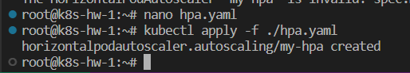
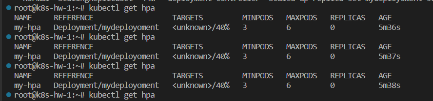
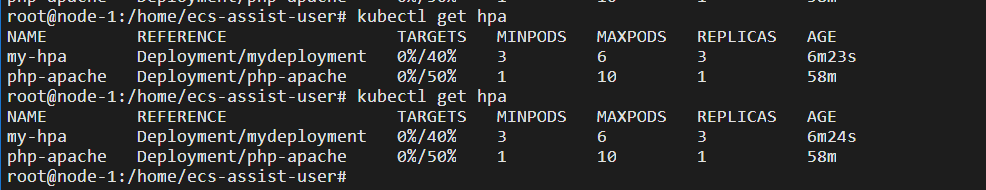
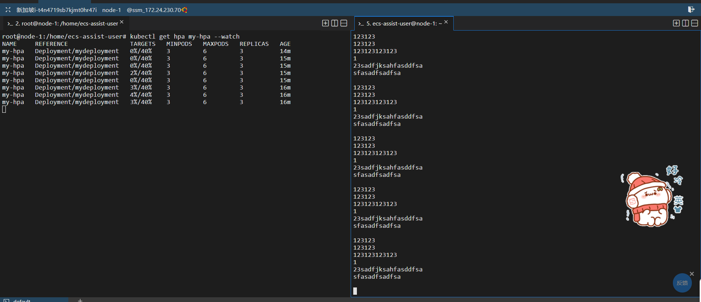
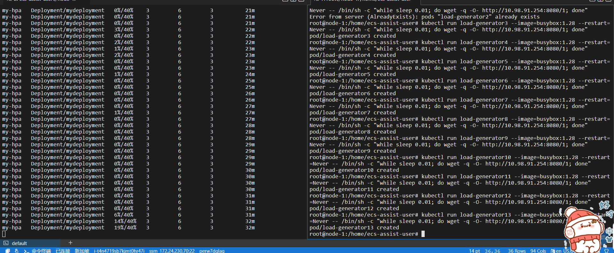
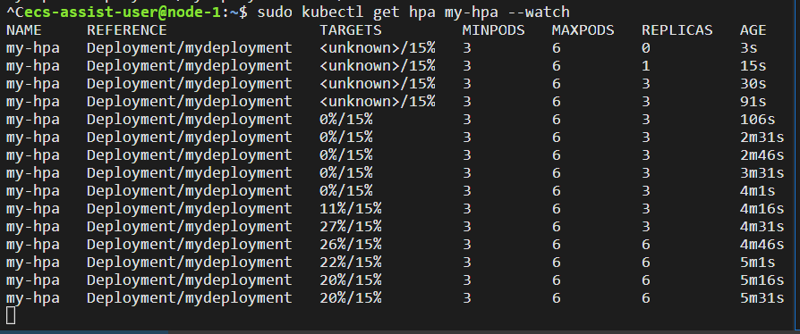
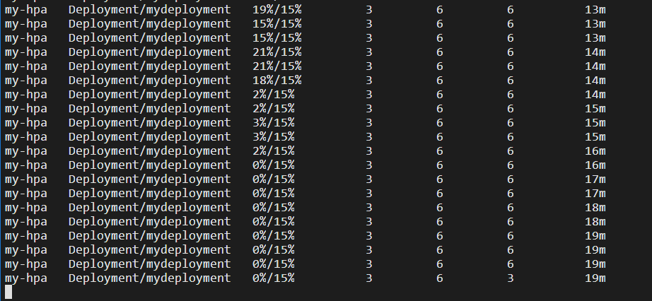

## HPA的部署

### 问题一：

首先，我发现我刚刚写的deploy里面，忘记写标签了，所以加上

然后我折腾了一下午，发现寄中寄！怎么都是unknown最后看到了这个！

> Please note that if some of the Pod’s containers do not have the relevant resource request set, CPU utilization for the Pod will not be defined and the autoscaler will not take any action for that metric. See the algorithm details section below for more information about how the autoscaling algorithm works

发现结论就是，不给container设置请求的cpu，他就不显示了！这！!加上。

```yaml
apiVersion: apps/v1
kind: Deployment
metadata:
  name: mydeployment
  labels:
    app: my-app
spec:
  #replicas: 3
  selector:
    matchLabels:
      app: my-app
  template:
    metadata:
      labels:
        app: my-app
    spec:
      containers:
        - name: fileserver
          image: hejingkai/fileserver:latest
          ports:
            - containerPort: 8080
          volumeMounts:
            - name: share-volume
              mountPath: /usr/share/files
          resources:
            limits:
              cpu: 500m
            requests:
              cpu: 200m
        - name: downloader
          image: hejingkai/downloader:latest
          ports:
            - containerPort: 3000
          volumeMounts:
            - name: share-volume
              mountPath: /data
          resources:
            limits:
              cpu: 500m
            requests:
              cpu: 200m
      volumes:
        - name: share-volume
          hostPath:
            path: /root/mountData
            type: DirectoryOrCreate
```

- 然后写HPA文件

```yaml
apiVersion: autoscaling/v2
kind: HorizontalPodAutoscaler
metadata:
  name: my-hpa
spec:
  scaleTargetRef:
    apiVersion: apps/v1
    kind: Deployment
    name: mydeployment
  minReplicas: 3
  maxReplicas: 6
  metrics:
    - type: Resource
      resource:
        name: cpu
        target:
          type: Utilization
          averageUtilization: 40
  behavior:
    scaleDown:
      policies:
      - type: Percent
        value: 10
        periodSeconds: 60
```



### 问题二：

和上面一样，已经在上面就写了。

```
  behavior:
    scaleDown:
      policies:
      - type: Percent
        value: 10
        periodSeconds: 60
```

值得注意的是，这是个新功能，要很新的API版本才能用。


写到这里并没玩，我发现：



寄中寄！然后回去老老实实读文档，发现我必须安装一个插件： [Metrics Server](https://github.com/kubernetes-sigs/metrics-server#readme) 

> 你必须拥有一个 Kubernetes 的集群，同时你的 Kubernetes 集群必须带有 kubectl 命令行工具。 建议在至少有两个节点的集群上运行本教程，且这些节点不作为控制平面主机。 如果你还没有集群，你可以通过 [Minikube](https://minikube.sigs.k8s.io/docs/tutorials/multi_node/) 构建一个你自己的集群，或者你可以使用下面任意一个 Kubernetes 工具构建：
>
> - [Killercoda](https://killercoda.com/playgrounds/scenario/kubernetes)
> - [玩转 Kubernetes](http://labs.play-with-k8s.com/)
>
> 你的 Kubernetes 服务器版本必须不低于版本 1.23. 要获知版本信息，请输入 `kubectl version`.
>
> 如果你运行的是旧版本的 Kubernetes，请参阅该版本的文档版本 （[可用的文档版本](https://kubernetes.io/zh-cn/docs/home/supported-doc-versions/)）。
>
> 按照本演练进行操作，你需要一个部署并配置了 [Metrics Server](https://github.com/kubernetes-sigs/metrics-server#readme) 的集群。 Kubernetes Metrics Server 从集群中的 [kubelets](https://kubernetes.io/docs/reference/generated/kubelet) 收集资源指标， 并通过 [Kubernetes API](https://kubernetes.io/zh-cn/docs/concepts/overview/kubernetes-api/) 公开这些指标， 使用 [APIService](https://kubernetes.io/zh-cn/docs/concepts/extend-kubernetes/api-extension/apiserver-aggregation/) 添加代表指标读数的新资源。
>
> 要了解如何部署 Metrics Server，请参阅 [metrics-server 文档](https://github.com/kubernetes-sigs/metrics-server#deployment)。

```
kubectl apply -f https://github.com/kubernetes-sigs/metrics-server/releases/latest/download/high-availability-1.21+.yaml
```

### 总结找不到HPA状态的原因

以下三个原因，只要有一个没折腾好，都会寄！

- 国内服务器下载不了监控[Metrics Server](https://github.com/kubernetes-sigs/metrics-server#readme) 的组件，所以会寄！（解决方法：不用jcloud、代理、用国外的服务器都行
- 参考文章说的，要给配置文件加一个参数，才能启动容器成功。[容器 & 服务：metrics-server 安装探索 - 腾讯云开发者社区-腾讯云 (tencent.com)](https://cloud.tencent.com/developer/article/1818865)【解决方法：把配置文件下载下来，然后加一个启动参数】
- 然后Pod必须声明式的写出：要resource的多少资源，不写照样会出问题

### 成功效果

踩了一晚上的坑，然后发现解决了，效果如下：（后面换阿里云了，所以界面不一样了）



然后为了体验能够自动扩缩容，根据官方教程，来给服务器加点压力

```
# 在单独的终端中运行它
# 以便负载生成继续，你可以继续执行其余步骤
kubectl run -i --tty load-generator1 --rm --image=busybox:1.28 --restart=Never -- /bin/sh -c "while sleep 0.01; do wget -q -O- http://10.98.91.254:8080/1; done"

kubectl run load-generator2 --image=busybox:1.28 --restart=Never -- /bin/sh -c "while sleep 0.01; do wget -q -O- http://10.98.91.254:8080/1; done"

```

- 增加压力后的效果如下，但是压力不明显



- 显然压力不够，继续！



- 后面写不动了，脚本！

```
for i in {1..100}
do
  name="load-generator$i"
  kubectl run "$name" --image=busybox:1.28 --restart=Never -- /bin/sh -c "while sleep 0.01; do wget -q -O- http://10.98.91.254:8080/1; done"
done
```

- 明显看到压力逐渐增大，然后看到REPLICAS从1变到3最后变到6max的。



```
for i in {1..100}
do
  name="load-generator${i}"
  # Delete Pod
  kubectl delete pod ${name} --grace-period=0 --force
done
```

如下，然后看到压力释放之后就慢慢下降了。



- 耗时一天总算做完了，退服务器去了！